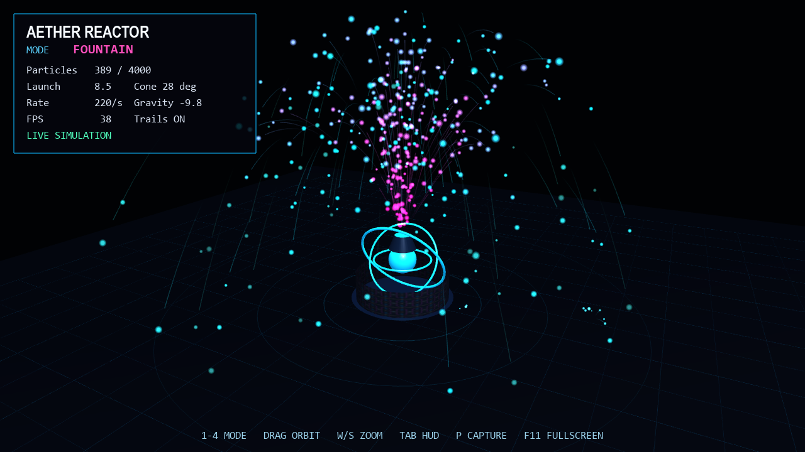

# Aether Reactor

A real-time particle simulation with four independently configured behaviors:
ballistic fountain, force-driven vortex, drifting embers, and fireworks. The
CPU simulation feeds a GLSL point-sprite renderer with additive light blending
and lifetime-based color.



## Features

- Four switchable particle systems with a 4,000-particle safety cap
- Shader-rendered soft particles and lifetime color ramps
- Optional trajectory trails and secondary impact sparks
- Textured reactor geometry, orbit camera, live tuning, and fullscreen support

## Run

```powershell
python -m venv .venv
.\.venv\Scripts\Activate.ps1
python -m pip install -r requirements.txt
python main.py
```

## Controls

| Input | Action |
| --- | --- |
| `1`–`4` | Select a particle mode |
| Mouse drag / wheel | Orbit / zoom |
| Left / Right | Change launch speed |
| `,` / `.` | Change launch cone angle |
| `+` / `-` | Change spawn rate |
| Up / Down | Change gravity |
| `T` | Toggle trails |
| `Space` | Pause the simulation |
| `R` | Clear particles |
| `Tab` | Toggle the interface |
| `P` | Save an image |
| `F11` | Toggle fullscreen |
| `Esc` | Quit |
