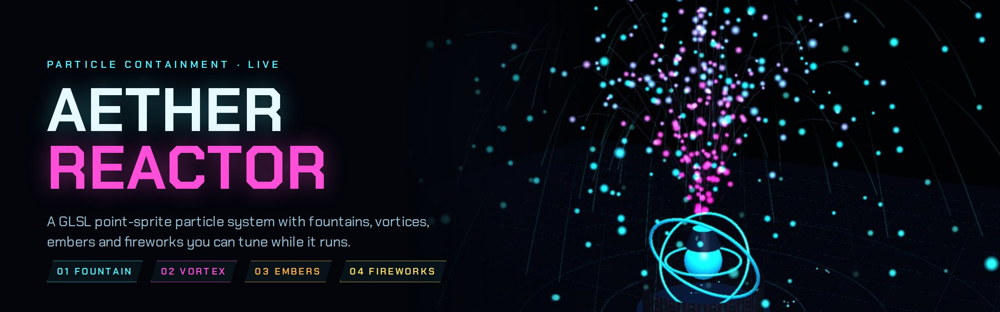
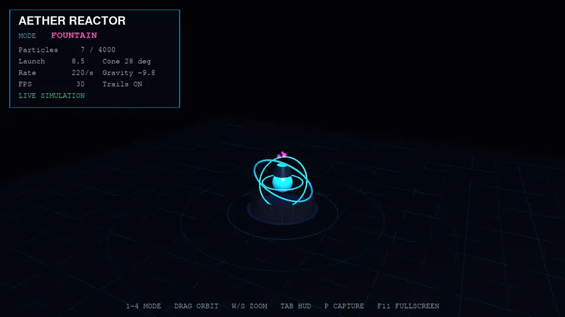
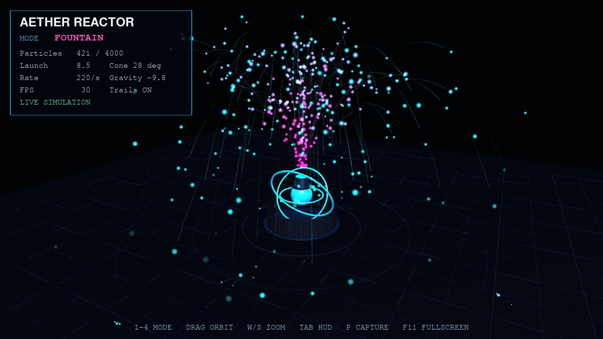
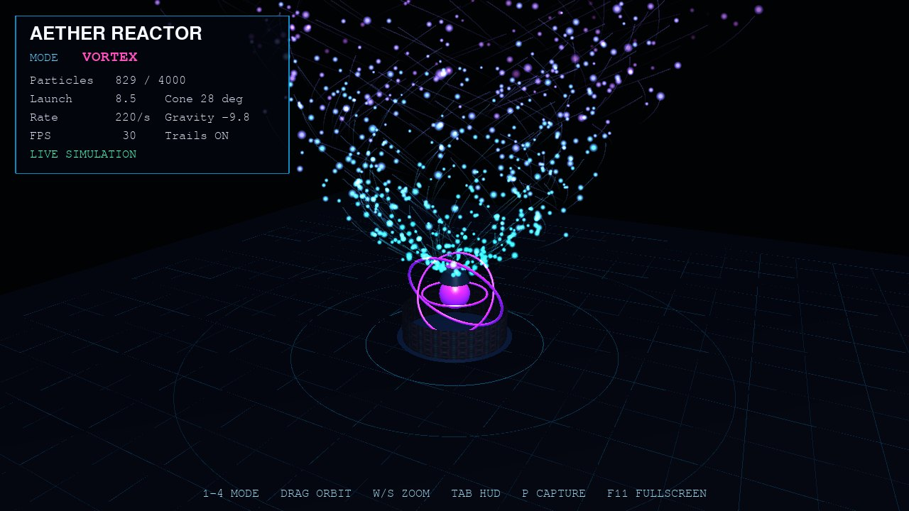
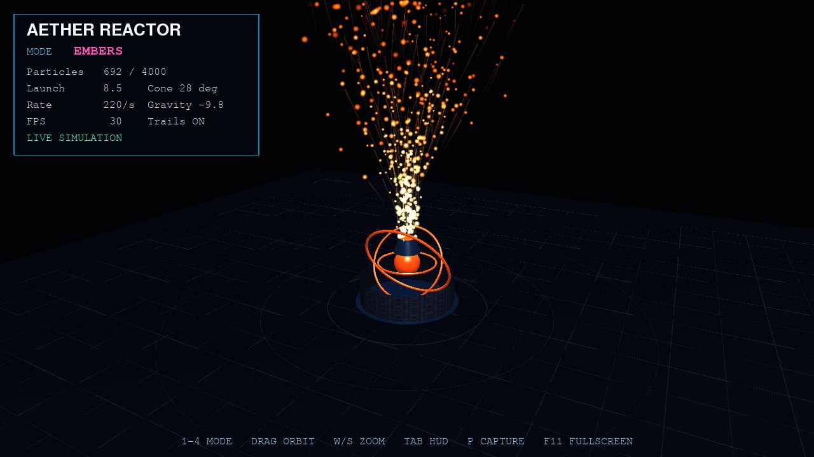
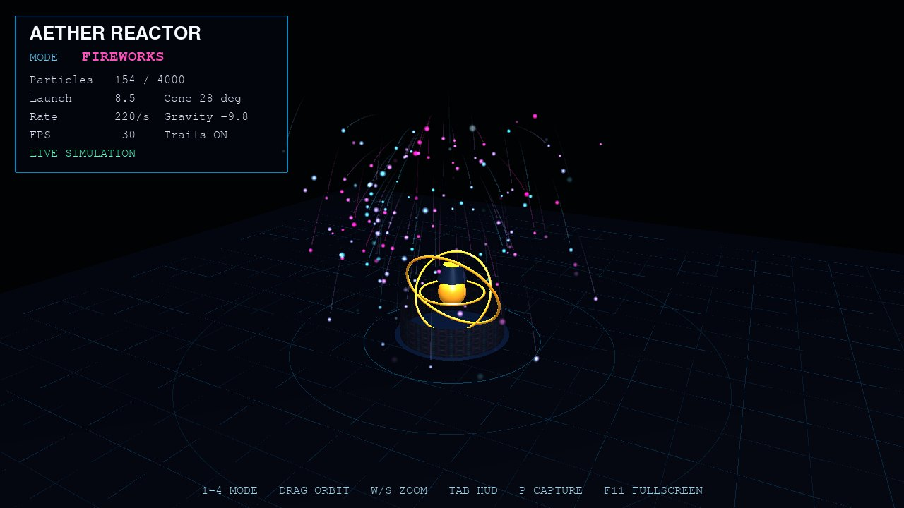

<p align="center"><code>PYTHON</code> · <code>PYGAME</code> · <code>PYOPENGL</code> · <code>NUMPY</code> · <code>GLSL</code></p>

A real-time particle reactor. Four particle systems, each with its own physics, are simulated on
the CPU and drawn by a GLSL point-sprite renderer with additive blending, so dense regions glow
and every particle shifts color over its lifetime. Launch speed, cone angle, spawn rate and
gravity can all be tuned while it runs.

<p align="center"></p>

## Four modes

<table>
  <tr>
    <td width="50%"><br><sub><b>1 · Fountain</b>: ballistic jets that fall back under gravity, with impact sparks</sub></td>
    <td width="50%"><br><sub><b>2 · Vortex</b>: a force field that spins particles up and around the core</sub></td>
  </tr>
  <tr>
    <td width="50%"><br><sub><b>3 · Embers</b>: slow, flickering sparks that drift and cool</sub></td>
    <td width="50%"><br><sub><b>4 · Fireworks</b>: rockets that climb, then burst into shells of sparks</sub></td>
  </tr>
</table>

## Features

- Four independently configured particle systems, capped at 4,000 live particles
- Soft, shader-drawn particles with additive light and lifetime color ramps
- Optional trajectory trails and secondary impact sparks
- A textured reactor core with orbiting rings, a grid floor, an orbit camera and fullscreen support

## Run

```bash
python -m venv .venv
source .venv/bin/activate          # Windows: .venv\Scripts\activate
pip install -r requirements.txt
python main.py
```

Needs Python 3.10 or newer and an OpenGL 2.1 capable GPU or driver.

## Controls

| Input | Action |
| :-- | :-- |
| <kbd>1</kbd>–<kbd>4</kbd> | Select a particle mode |
| Mouse drag / wheel | Orbit / zoom |
| <kbd>←</kbd> / <kbd>→</kbd> | Launch speed |
| <kbd>,</kbd> / <kbd>.</kbd> | Launch cone angle |
| <kbd>+</kbd> / <kbd>-</kbd> | Spawn rate |
| <kbd>↑</kbd> / <kbd>↓</kbd> | Gravity |
| <kbd>T</kbd> | Toggle trails |
| <kbd>Space</kbd> | Pause the simulation |
| <kbd>R</kbd> | Clear particles |
| <kbd>Tab</kbd> | Toggle the interface |
| <kbd>P</kbd> | Save an image |
| <kbd>F11</kbd> / <kbd>Esc</kbd> | Fullscreen / quit |

## How it works

- **Simulation** (`main.py`, `ParticleSystem`): each mode has its own spawner. Particles carry
  position, velocity, age and lifetime; every frame applies gravity or the vortex force, ages them
  and retires the dead. A firework is a short-lived rocket that, when its life ends, is replaced by a
  spherical burst in one of three two-tone palettes.
- **Rendering** (`shaders/particle.vert`, `shaders/particle.frag`): particles are uploaded as
  point sprites. The vertex shader sizes them by distance and the fragment shader draws a soft
  radial falloff, blended additively so overlapping particles brighten.
- **Color** comes from mixing a mode's start and end colors by the particle's age.

## Files

```text
main.py                 simulation, renderer, HUD and input
shaders/particle.*      point-sprite vertex and fragment shaders
assets/                 reactor texture (project-created)
media/                  README banner, tour and stills
```

<sub>[← All projects](../../README.md) · Media regenerated with [`tools/render_tour.py`](../../tools/render_tour.py)</sub>
