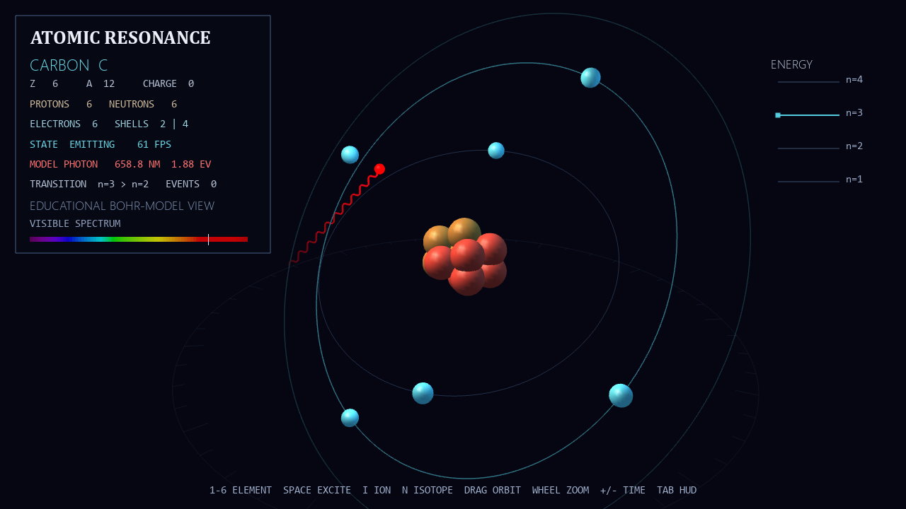

# Atomic Resonance

An interactive atomic-structure visualization covering Hydrogen, Helium,
Lithium, Carbon, Oxygen, and Neon. Element, isotope, and charge controls update
the nucleus and shell occupancy, while an excitation sequence connects a model
transition to photon wavelength, color, and energy.



## Features

- Deterministic proton and neutron arrangements
- Neutral, cation, anion, and isotope states
- Electron-shell occupancy derived from the active particle count
- Timed excitation, emission, wavelength color, and photon-energy readout

## Run

```powershell
python -m venv .venv
.\.venv\Scripts\Activate.ps1
python -m pip install -r requirements.txt
python main.py
```

## Controls

| Input | Action |
| --- | --- |
| `1`–`6` | Select an element |
| `Space` | Excite the outer electron |
| `I` / `N` | Cycle charge / isotope |
| Mouse drag / wheel | Orbit / zoom |
| `+` / `-` | Change simulation speed |
| `M` / `Tab` | Toggle model note / interface |
| `P` | Save an image |
| `F11` | Toggle fullscreen |
| `0` | Reset the camera |
| `Esc` | Quit |

## Model Scope

Shell paths are an educational Bohr-model representation rather than literal
electron trajectories. The wavelength readout uses representative visible
spectral lines to connect emission, color, and photon energy.
