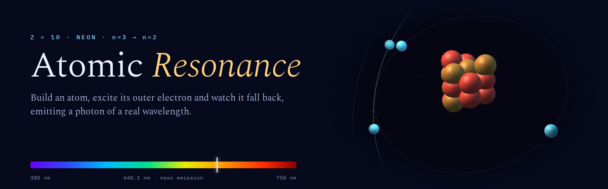
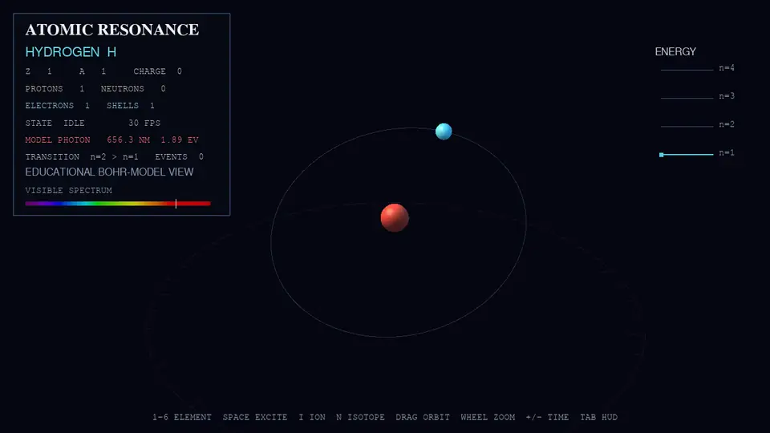
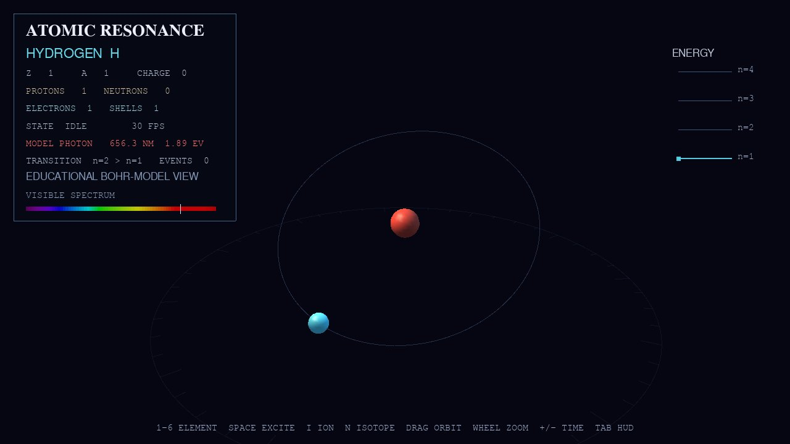
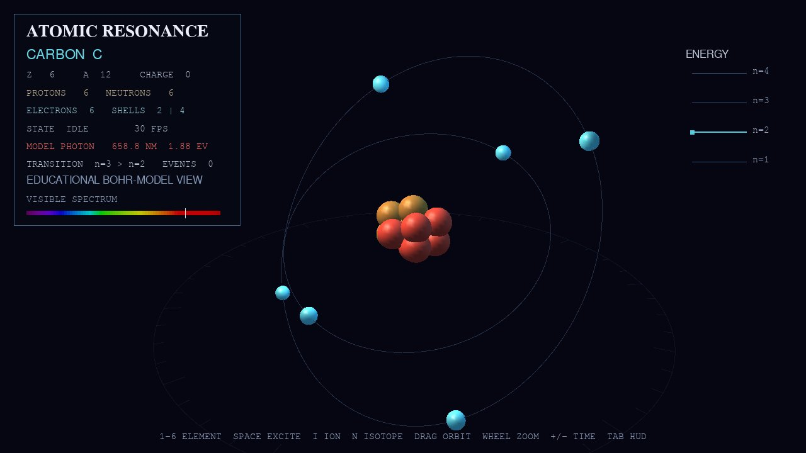
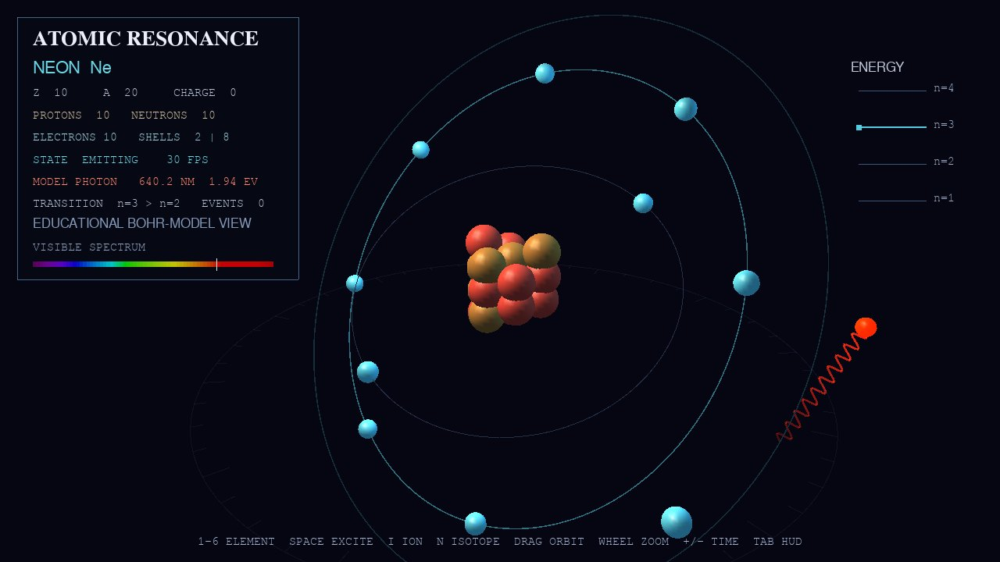

<p align="center"><code>PYTHON</code> · <code>PYGAME</code> · <code>PYOPENGL</code></p>

An interactive Bohr-model visualization of six elements. Pick an element, change its isotope or
charge, and the nucleus and electron shells rebuild to match. Press <kbd>Space</kbd> and the outer
electron jumps up a shell, falls back, and releases a photon whose color, wavelength and energy
come from a real spectral line of that element.

<p align="center"></p>

<table>
  <tr>
    <td width="33%"><br><sub><b>Hydrogen</b> · 1 shell</sub></td>
    <td width="33%"><br><sub><b>Carbon</b> · shells 2 | 4</sub></td>
    <td width="33%"><br><sub><b>Neon</b> · emitting at 640.2 nm</sub></td>
  </tr>
</table>

## The six elements

| Key | Element | Isotopes | Spectral line used | Photon energy |
| :-: | :-- | :-- | --: | --: |
| <kbd>1</kbd> | Hydrogen (H) | ¹H, ²H, ³H | 656.28 nm (Hα) | 1.89 eV |
| <kbd>2</kbd> | Helium (He) | ⁴He, ³He | 587.56 nm | 2.11 eV |
| <kbd>3</kbd> | Lithium (Li) | ⁷Li, ⁶Li | 670.78 nm | 1.85 eV |
| <kbd>4</kbd> | Carbon (C) | ¹²C, ¹³C, ¹⁴C | 658.76 nm | 1.88 eV |
| <kbd>5</kbd> | Oxygen (O) | ¹⁶O, ¹⁷O, ¹⁸O | 615.82 nm | 2.01 eV |
| <kbd>6</kbd> | Neon (Ne) | ²⁰Ne, ²¹Ne, ²²Ne | 640.22 nm | 1.94 eV |

Energy is computed as *E = hc / λ* with *hc* = 1239.84 eV·nm.

## Features

- Deterministic proton and neutron packing for every element and isotope
- Neutral, cation and anion states, with shells filled 2, 8, 8 from the active electron count
- A timed excite → emit sequence with an energy-level ladder and transition label
- Wavelength-accurate photon color, a visible-spectrum marker and an energy readout

## Run

```bash
python -m venv .venv
source .venv/bin/activate          # Windows: .venv\Scripts\activate
pip install -r requirements.txt
python main.py
```

## Controls

| Input | Action |
| :-- | :-- |
| <kbd>1</kbd>–<kbd>6</kbd> | Select an element |
| <kbd>Space</kbd> | Excite the outer electron |
| <kbd>I</kbd> / <kbd>N</kbd> | Cycle charge / isotope |
| Mouse drag / wheel | Orbit / zoom |
| <kbd>+</kbd> / <kbd>-</kbd> | Simulation speed |
| <kbd>M</kbd> / <kbd>Tab</kbd> | Toggle the model note / interface |
| <kbd>0</kbd> | Reset the camera |
| <kbd>P</kbd> | Save an image |
| <kbd>F11</kbd> / <kbd>Esc</kbd> | Fullscreen / quit |

<details>
<summary><b>Launch options</b></summary>
<br>

| Variable | Effect |
| :-- | :-- |
| `ATOM_ELEMENT` | Start on an element by symbol, name or number, for example `Ne` |
| `ATOM_AUTO_EXCITE=1` | Excite the electron automatically |
| `PORTFOLIO_SIZE` | Window size, for example `1600x900` |
| `PORTFOLIO_FULLSCREEN=1` | Start fullscreen |
| `ATOM_CAPTURE`, `ATOM_CAPTURE_FRAME` | Save an image to a path at a given frame, then quit |

</details>

## Model scope

Shell paths are an educational Bohr-model picture, not real electron trajectories, and each
element uses one representative visible line rather than its full spectrum. The point is to
connect a transition to a color you can see and an energy you can compute.

## Tests

```bash
pip install pytest
python -m pytest tests
```

The tests check shell filling, neutral atoms and charge states, isotopes changing only the
neutron count, photon energy as hc/λ, the visible-light color mapping, the nucleus layout and the
excite-and-emit sequence.

## Files

```text
main.py          rendering, HUD, camera and input
simulation.py    elements, isotopes, shell filling, emission timing, wavelength to color
tests/           pytest checks for the atomic model
media/           README banner, tour and stills
```

<sub>[← All projects](../../README.md) · Media regenerated with [`tools/render_tour.py`](../../tools/render_tour.py)</sub>
