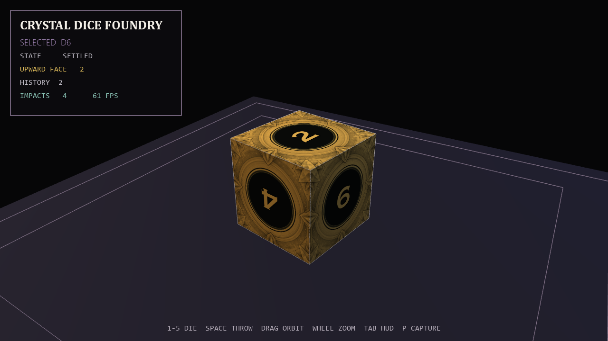

# Crystal Dice Foundry

An interactive roller for D4, D6, D8, D12, and D20 polyhedral dice. Each throw
uses quaternion rotation, gravity, bounce, and angular damping; the final value
is calculated from the upward-facing normal after the die settles.



## Features

- Five procedurally defined polyhedral meshes
- Per-face texture-atlas mapping and valid opposite-face numbering
- Quaternion orientation, impacts, damping, and stable settling
- Calculated results, roll history, camera control, and fullscreen rendering

## Run

```powershell
python -m venv .venv
.\.venv\Scripts\Activate.ps1
python -m pip install -r requirements.txt
python main.py
```

## Controls

| Input | Action |
| --- | --- |
| `1`–`5` | Select D4, D6, D8, D12, or D20 |
| `Space` / `Enter` | Throw the selected die |
| Mouse drag / wheel | Orbit / zoom |
| `Tab` | Toggle the interface |
| `P` | Save an image |
| `F11` | Toggle fullscreen |
| `Esc` | Quit |
