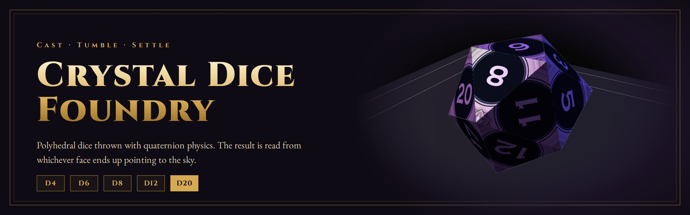
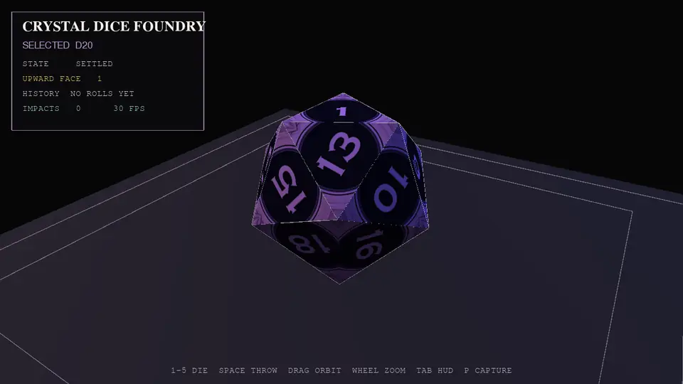
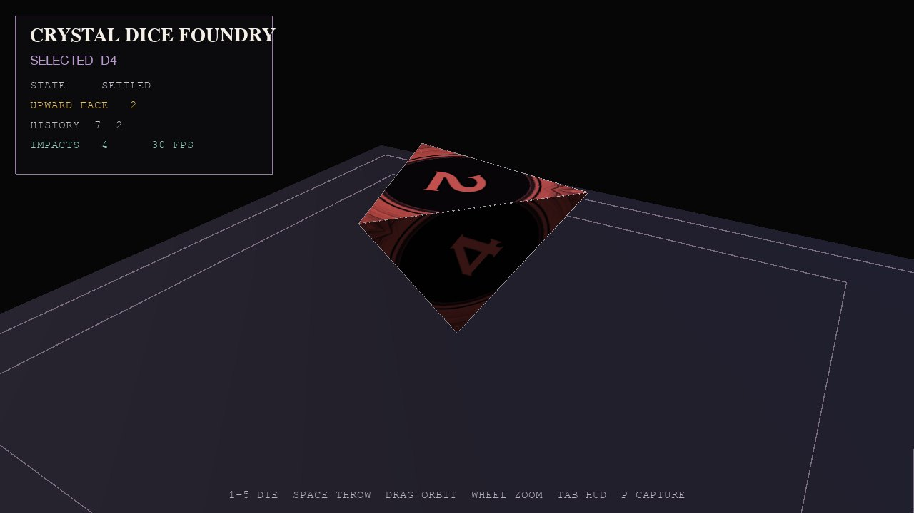
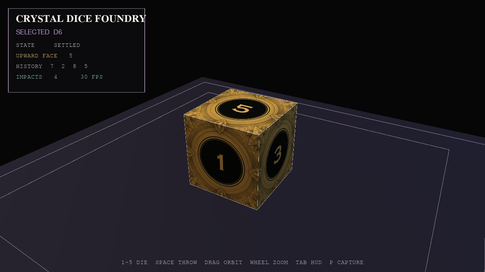
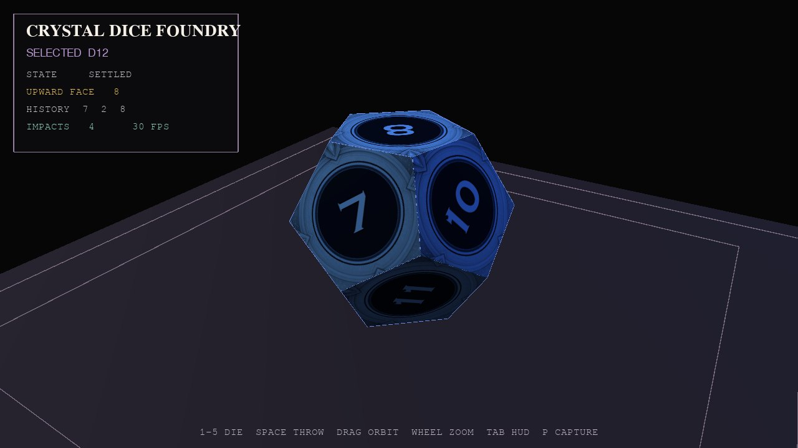
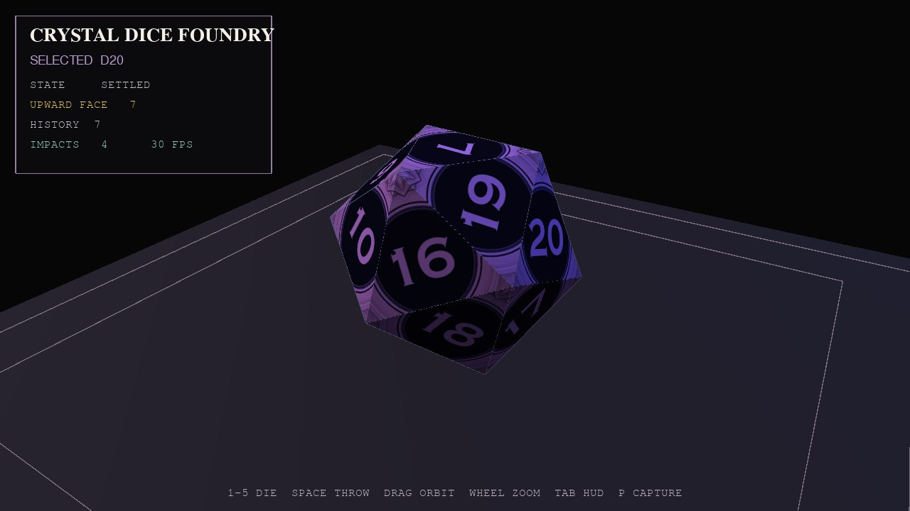

<p align="center"><code>PYTHON</code> · <code>PYGAME</code> · <code>PYOPENGL</code></p>

A dice tray for the five classic polyhedral dice. Every throw starts with a random spin and drop,
tumbles under gravity with bounces and damping, and comes to rest on a face. The result isn't
picked in advance: it is read from whichever face normal points most nearly straight up once the
die stops moving.

<p align="center"></p>

<table>
  <tr>
    <td width="25%"><br><sub><b>D4</b></sub></td>
    <td width="25%"><br><sub><b>D6</b></sub></td>
    <td width="25%"><br><sub><b>D12</b></sub></td>
    <td width="25%"><br><sub><b>D20</b></sub></td>
  </tr>
</table>

## Features

- D4, D6, D8, D12 and D20 meshes built in code, each with its own material
- A single texture atlas of numbers, mapped per face, with valid opposite-face numbering
- Quaternion orientation, gravity, bounces, angular damping and a stable settle
- The calculated result, a roll history, an orbit camera and fullscreen rendering

## Run

```bash
python -m venv .venv
source .venv/bin/activate          # Windows: .venv\Scripts\activate
pip install -r requirements.txt
python main.py
```

## Controls

| Input | Action |
| :-- | :-- |
| <kbd>1</kbd>–<kbd>5</kbd> | Select D4, D6, D8, D12 or D20 |
| <kbd>Space</kbd> / <kbd>Enter</kbd> | Throw the selected die |
| Mouse drag / wheel | Orbit / zoom |
| <kbd>Tab</kbd> | Toggle the interface |
| <kbd>P</kbd> | Save an image |
| <kbd>F11</kbd> / <kbd>Esc</kbd> | Fullscreen / quit |

<details>
<summary><b>Launch options</b></summary>
<br>

| Variable | Effect |
| :-- | :-- |
| `DICE_SELECTED` | Starting die, `0` (D4) to `4` (D20). Defaults to `1` (D6) |
| `DICE_AUTO_ROLL=1` | Throw once on start |
| `PORTFOLIO_SIZE` | Window size, for example `1600x900` |
| `PORTFOLIO_FULLSCREEN=1` | Start fullscreen |
| `DICE_CAPTURE`, `DICE_CAPTURE_FRAME` | Save an image to a path at a given frame, then quit |

</details>

## How a throw works

1. **Launch.** `physics.py` picks a random axis and angle for the starting orientation, a random
   angular velocity, a drop height and an upward velocity.
2. **Tumble.** Each step rotates the orientation quaternion by the angular velocity, applies
   gravity (9.8 m/s²), and checks the lowest transformed vertex against the tray.
3. **Bounce.** On contact the die is pushed back above the floor, keeps 34% of its vertical speed
   and 58% of its spin. Spin also decays a little every frame.
4. **Settle.** After four impacts with almost no motion left (or five seconds), the face whose
   normal points most nearly up is snapped exactly upright, and its number is the result.

## Tests

```bash
pip install pytest
python -m pytest tests
```

The tests throw every die from ten seeds and check that it settles flat with the reported face
facing up, that a seed always gives the same result, that quaternions rotate correctly, and that
opposite faces add up to one more than the number of sides.

## Files

```text
main.py         rendering, tray, HUD, history and input
physics.py      quaternions, throw, bounce and settle
geometry.py     the five solids, face normals and orientation
assets/         number texture atlas (project-created)
tests/          pytest checks for the physics and numbering
media/          README banner, tour and stills
```

<sub>[← All projects](../../README.md) · Media regenerated with [`tools/render_tour.py`](../../tools/render_tour.py)</sub>
