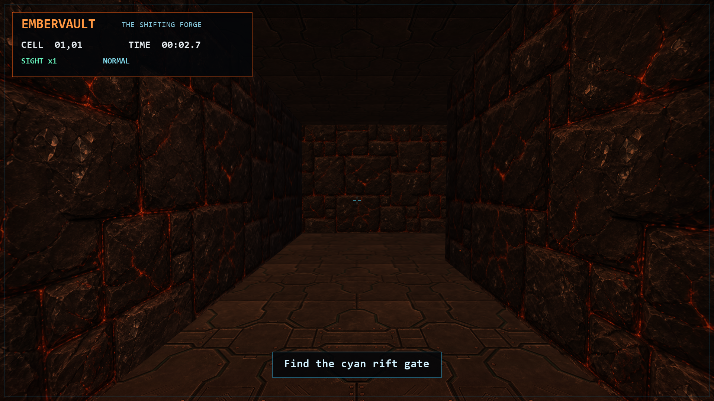

# Embervault: The Shifting Forge

A first-person maze game set inside a procedural volcanic forge. Every run
generates a reachable 12×12 maze with traps, temporary abilities, textured
geometry, positional atmosphere, and a portal objective.



## Features

- Randomized reachable mazes with collision-aware first-person movement
- Lighting, fog, textured surfaces, animated features, and responsive HUD
- Speed, route-vision, and overhead-view abilities
- Movement traps, view-shift hazards, audio cues, and timed completion

## Run

```powershell
python -m venv .venv
.\.venv\Scripts\Activate.ps1
python -m pip install -r requirements.txt
python main.py
```

## Controls

| Input | Action |
| --- | --- |
| `W`, `A`, `S`, `D` | Move |
| Mouse | Look around |
| `Q` | Use route vision |
| `H` | Open the help overlay |
| `R` / `N` | Restart / generate a new maze |
| `M` / `J` | Toggle audio / scare effect |
| `F10` / `F11` | Change resolution / toggle fullscreen |
| `Esc` | Quit |
