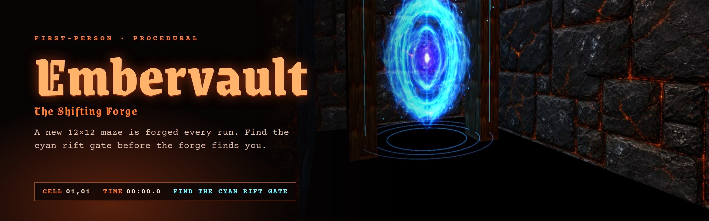
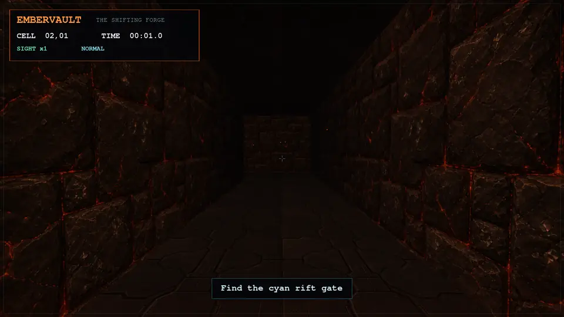
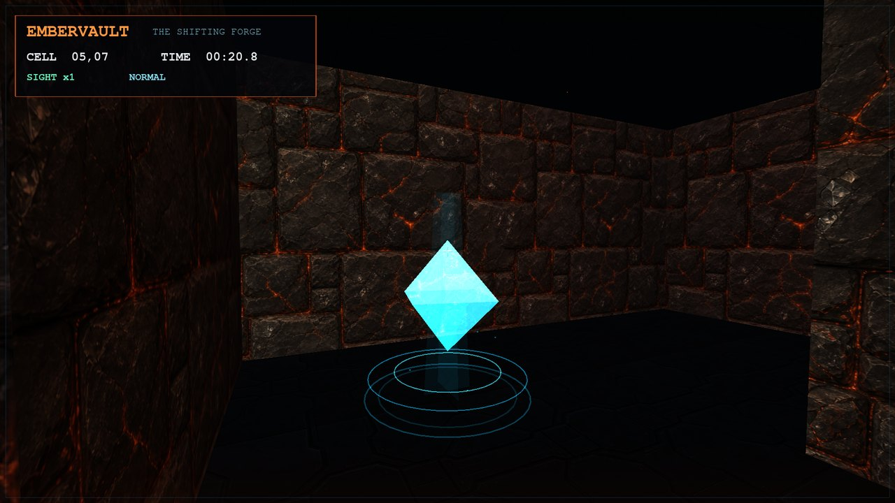
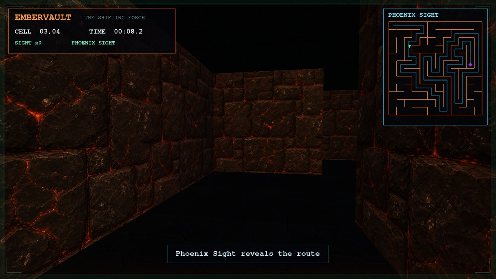
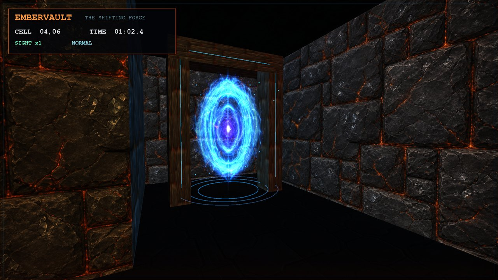
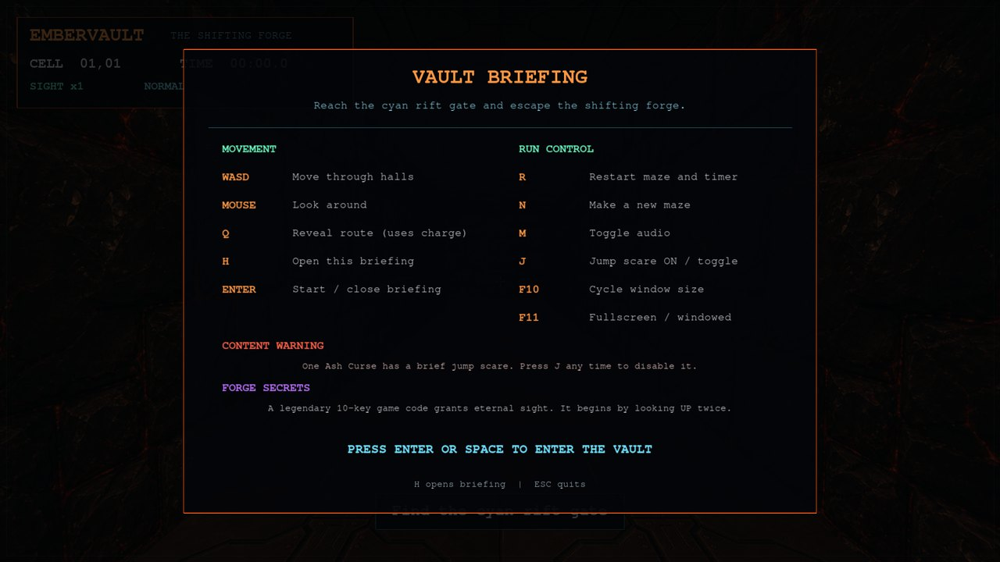
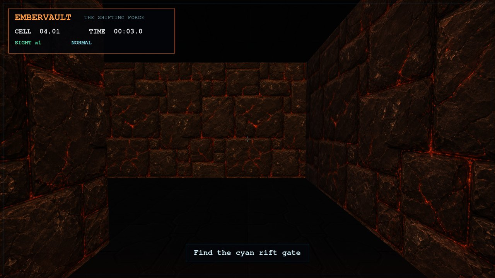
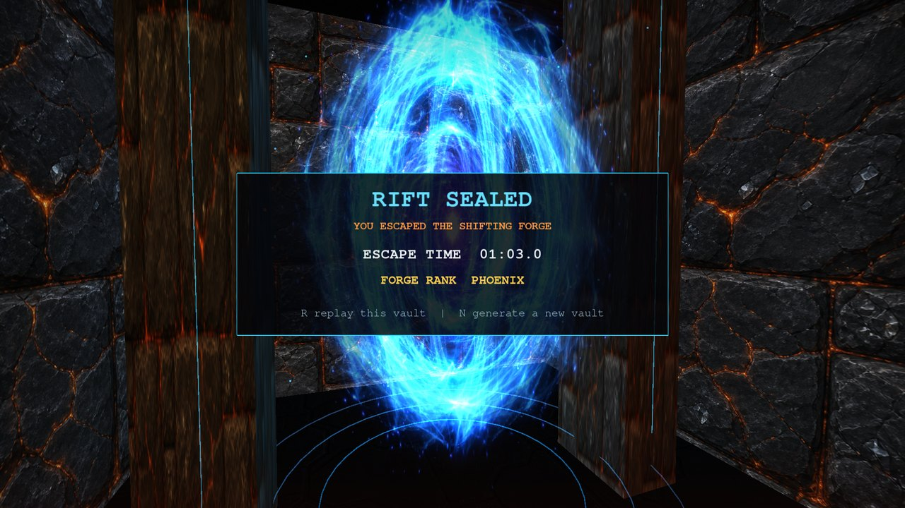

<p align="center"><code>PYTHON</code> · <code>PYGAME</code> · <code>PYOPENGL</code> · <code>PROCEDURAL</code> · <code>FIRST-PERSON</code></p>

A first-person escape through a volcanic forge. Every run carves a new 12×12 maze, scatters traps
and power-ups along it, and hides a cyan rift gate at the cell farthest from the entrance. Walk the
lava-lit halls, read the runes, and get out before your time ranks you a mere Vault Breaker.

<p align="center"></p>

<table>
  <tr>
    <td width="33%"><br><sub><b>Cinder crystal</b> · a burst of haste</sub></td>
    <td width="33%"><br><sub><b>Phoenix Sight</b> · the route, for 7 seconds</sub></td>
    <td width="33%"><br><sub><b>The rift gate</b> · the way out</sub></td>
  </tr>
  <tr>
    <td width="33%"><br><sub><b>Vault briefing</b> · controls before you start</sub></td>
    <td width="33%"><br><sub><b>The forge</b> · textured halls, fog and firelight</sub></td>
    <td width="33%"><br><sub><b>Rift sealed</b> · your time and forge rank</sub></td>
  </tr>
</table>

## What's in the forge

| Feature | Effect |
| :-- | :-- |
| **Cinder crystal** | Haste for 5.5 seconds |
| **Forge eye** | One more charge of Phoenix Sight |
| **Skyforge lift** | Lifts you above the maze for an overhead look |
| **Molten snare** | Lava that slows you for 3.4 seconds |
| **Shift rune** | Turns your view 90 degrees |
| **Ash curse** | Sends you back to the entrance, with a brief jump scare (it can be turned off) |
| **Rift gate** | The exit, at the far end of the longest route |

Escape in under 90 seconds for **Phoenix**, under 3 minutes for **Rift Runner**, otherwise
**Vault Breaker**.

## Run

```bash
python -m venv .venv
source .venv/bin/activate          # Windows: .venv\Scripts\activate
pip install -r requirements.txt
python main.py
```

The window picks the largest of 960×540 to 1920×1080 that fits your screen.

## Controls

| Input | Action |
| :-- | :-- |
| <kbd>W</kbd> <kbd>A</kbd> <kbd>S</kbd> <kbd>D</kbd> | Move |
| Mouse | Look around |
| <kbd>Q</kbd> | Use Phoenix Sight (reveals the route) |
| <kbd>H</kbd> / <kbd>Enter</kbd> | Open / close the briefing |
| <kbd>R</kbd> / <kbd>N</kbd> | Restart this maze / forge a new one |
| <kbd>M</kbd> / <kbd>J</kbd> | Toggle audio / the jump scare |
| <kbd>F10</kbd> / <kbd>F11</kbd> | Cycle window size / fullscreen |
| <kbd>Esc</kbd> | Quit |

> [!NOTE]
> The Ash Curse plays a short jump scare. Press <kbd>J</kbd> at any time to disable it.

## How it works

- **Maze** (`maze.py`): a depth-first backtracker carves a perfect maze, so every cell is
  reachable. A breadth-first search from the entrance finds the farthest cell, which becomes the
  exit; the generator tries up to eight mazes and keeps the one with the longest route. Features
  are then placed along and beside that route.
- **World** (`graphics.py`): walls, floor and ceiling are textured boxes lit by fixed-function
  OpenGL lights, with fog for depth, flickering braziers, drifting embers and an animated portal.
- **Movement** (`main.py`): collision is checked against the maze walls with a player radius, so
  you slide along walls instead of sticking to them.
- **Audio** (`audio.py`): ambience, footsteps and event cues, with a silent fallback if no audio
  device is available.

## Files

```text
main.py             game loop, input, features and HUD state
maze.py             maze generation, routing and collision
graphics.py         world, lighting, HUD and minimap
audio.py            sound loading and playback
assets/textures/    wall, floor, lava and portal textures (project-created)
assets/audio/       ambience and effects (project-created)
media/              README banner, tour and stills
```

<sub>[← All projects](../../README.md) · Media regenerated with [`tools/render_tour.py`](../../tools/render_tour.py)</sub>
