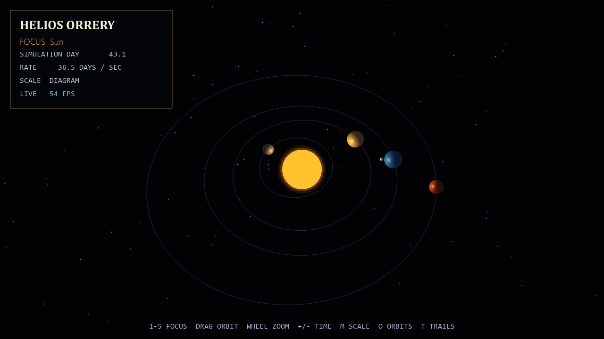

# Helios Orrery

A real-time inner-solar-system visualization driven by hierarchical transforms
and orbital-period ratios. Cameras can follow individual bodies while the Moon
remains correctly positioned relative to Earth.



## Features

- Mercury, Venus, Earth, Moon, and Mars with inclined elliptical paths
- Whole-system and tracked-body camera modes
- Diagram and relative-size views
- Adjustable time scale, trails, orbit guides, and deterministic star field

## Run

```powershell
python -m venv .venv
.\.venv\Scripts\Activate.ps1
python -m pip install -r requirements.txt
python main.py
```

## Controls

| Input | Action |
| --- | --- |
| `1`–`5` | Focus a celestial body |
| Mouse drag / wheel | Orbit / zoom |
| `+` / `-` | Change simulation speed |
| `Space` | Pause motion |
| `M` | Toggle the scale model |
| `O` / `T` | Toggle orbit guides / trails |
| `Tab` | Toggle the interface |
| `P` | Save an image |
| `F11` | Toggle fullscreen |
| `Esc` | Quit |
