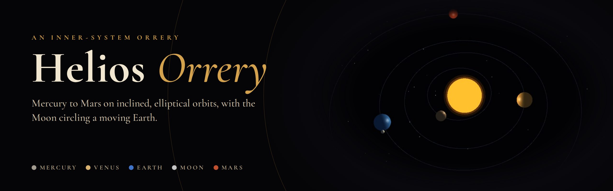
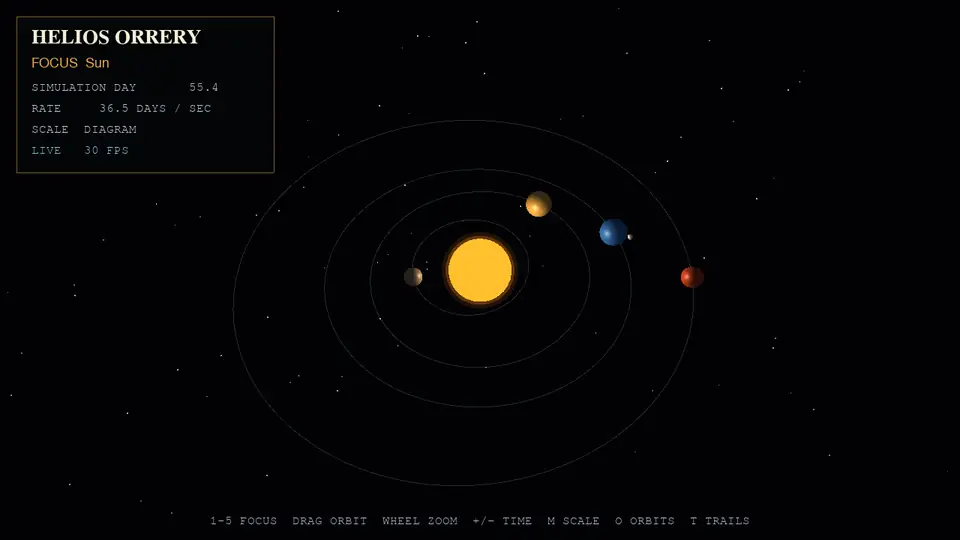
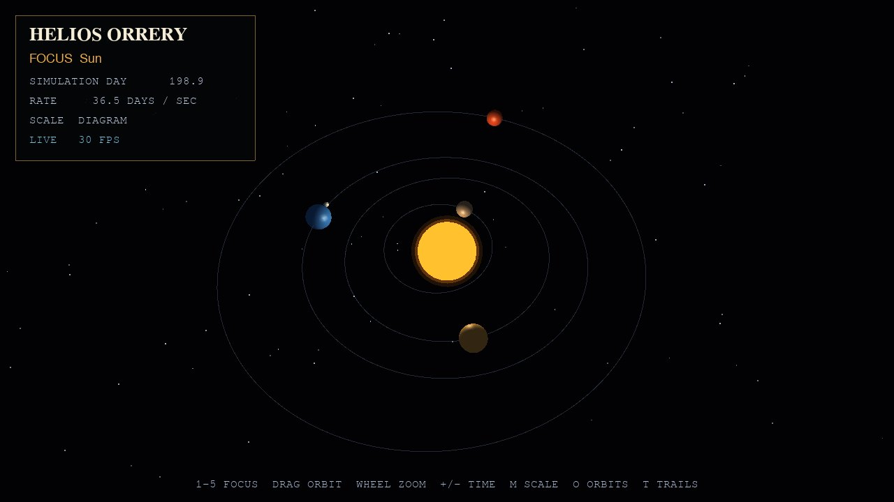
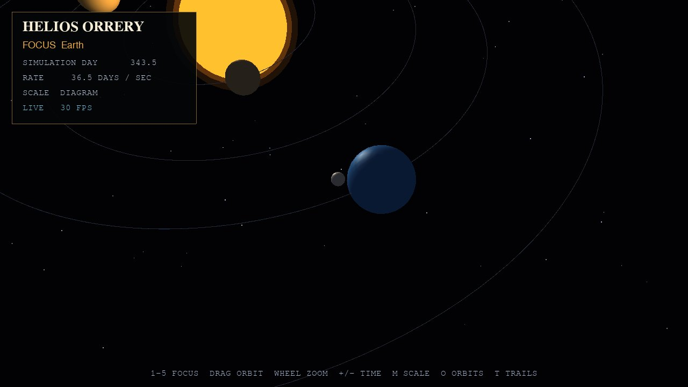
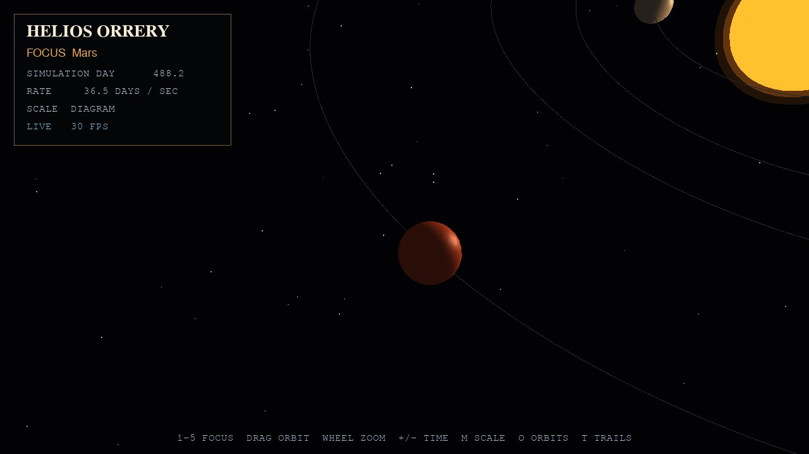

<p align="center"><code>PYTHON</code> · <code>PYGAME</code> · <code>PYOPENGL</code></p>

A mechanical orrery for the inner solar system, rendered in real time. Mercury, Venus, Earth and
Mars travel tilted, elliptical Kepler orbits at their true relative periods, the Moon circles Earth every
27.3 days, and the camera can sit back and watch the whole system or ride along with any planet.

<p align="center"></p>

<table>
  <tr>
    <td width="33%"><br><sub><b>1 · Sun</b> · the whole system</sub></td>
    <td width="33%"><br><sub><b>4 · Earth</b> · with the Moon</sub></td>
    <td width="33%"><br><sub><b>5 · Mars</b> · the outermost body</sub></td>
  </tr>
</table>

## The bodies

| Body | Orbit (AU) | Period (days) | Eccentricity | Inclination |
| :-- | --: | --: | --: | --: |
| Mercury | 0.39 | 87.97 | 0.206 | 7.00° |
| Venus | 0.72 | 224.70 | 0.007 | 3.39° |
| Earth | 1.00 | 365.26 | 0.017 | 0.00° |
| Mars | 1.50 | 686.98 | 0.093 | 1.85° |
| Moon | around Earth | 27.3 | | |

## Features

- Whole-system and follow-a-body cameras, with smooth transitions between them
- A diagram view for readability and a relative-size view for planet scale
- Adjustable time, from 1 to 1,200 days per second, plus pause
- Orbit guides, motion trails and a deterministic star field

## Run

```bash
python -m venv .venv
source .venv/bin/activate          # Windows: .venv\Scripts\activate
pip install -r requirements.txt
python main.py
```

## Controls

| Input | Action |
| :-- | :-- |
| <kbd>1</kbd>–<kbd>5</kbd> | Focus the Sun, Mercury, Venus, Earth or Mars |
| Mouse drag / wheel | Orbit / zoom |
| <kbd>+</kbd> / <kbd>-</kbd> | Speed time up / slow it down |
| <kbd>Space</kbd> | Pause |
| <kbd>M</kbd> | Switch between diagram and relative sizes |
| <kbd>O</kbd> / <kbd>T</kbd> | Toggle orbit guides / trails |
| <kbd>0</kbd> | Reset the camera |
| <kbd>Tab</kbd> | Toggle the interface |
| <kbd>P</kbd> | Save an image |
| <kbd>F11</kbd> / <kbd>Esc</kbd> | Fullscreen / quit |

<details>
<summary><b>Launch options</b></summary>
<br>

| Variable | Effect |
| :-- | :-- |
| `PORTFOLIO_SIZE` | Window size, for example `1600x900` |
| `PORTFOLIO_FULLSCREEN=1` | Start fullscreen |
| `ORRERY_CAPTURE`, `ORRERY_CAPTURE_FRAME` | Save an image to a path at a given frame, then quit |

</details>

## How it works

- **Orbits** (`simulation.py`): each planet's mean anomaly grows evenly with time over its period.
  Newton's method solves Kepler's equation, *M = E − e sin E*, for the eccentric anomaly, which
  places the planet on an ellipse with the Sun at one focus, tilted by the orbit's inclination.
  The result obeys Kepler's second law: Mercury moves about 1.5× faster at perihelion than at
  aphelion.
- **The Moon** is positioned relative to Earth's current position, so it follows Earth around the
  Sun while making its own 27.3-day loop.
- **The camera** eases toward the focused body each frame, so switching targets glides rather
  than jumps.

## Tests

```bash
pip install pytest
python -m pytest tests
```

The tests check that each orbit returns to its start after one period, stays between perihelion
and aphelion distance, speeds up near the Sun by the ratio Kepler's laws predict, and keeps the
Moon at a fixed distance from Earth.

## Files

```text
main.py          rendering, cameras, trails, HUD and input
simulation.py    orbital elements, Kepler's equation and positions
tests/           pytest checks for the orbital model
media/           README banner, tour and stills
```

<sub>[← All projects](../../README.md) · Media regenerated with [`tools/render_tour.py`](../../tools/render_tour.py)</sub>
