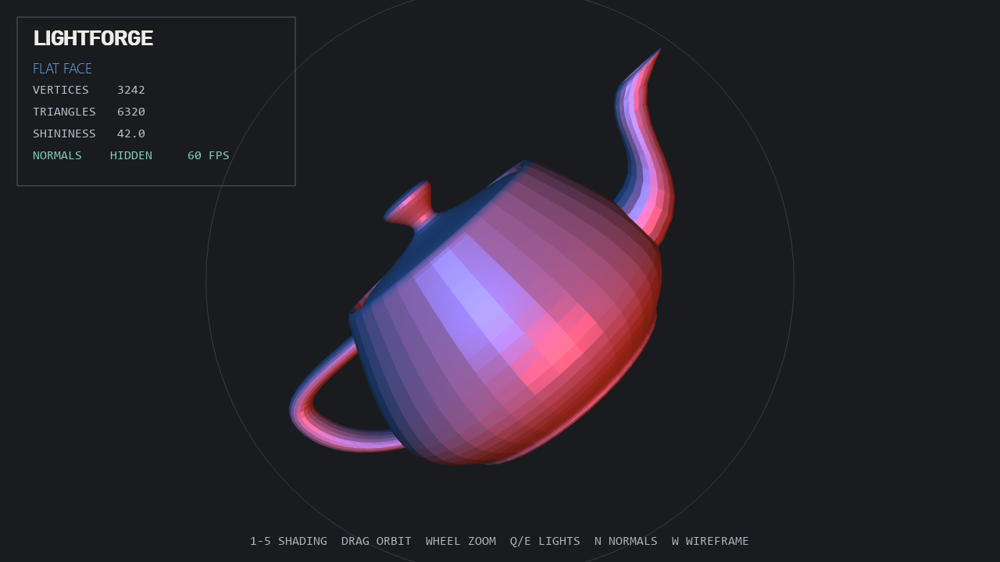

# LightForge

A real-time Utah teapot renderer for comparing surface-normal generation and
shading techniques. A custom OBJ loader supplies the mesh while GLSL programs
switch between flat, Gouraud, Phong, normal-color, and toon rendering.



## Features

- Custom Wavefront OBJ parsing and fan triangulation
- Cross-product face normals and averaged vertex normals
- Five selectable shading modes
- Movable red/blue lights, adjustable shininess, wireframe, and normal overlays

## Run

```powershell
python -m venv .venv
.\.venv\Scripts\Activate.ps1
python -m pip install -r requirements.txt
python main.py
```

## Controls

| Input | Action |
| --- | --- |
| `1`–`5` | Select a shading mode |
| Mouse drag / wheel | Orbit / zoom |
| `Q` / `E` | Move the light pair |
| Up / Down | Adjust shininess |
| `N` / `W` | Toggle normals / wireframe |
| `Space` | Pause rotation |
| `Tab` | Toggle the interface |
| `P` | Save an image |
| `F11` | Toggle fullscreen |
| `Esc` | Quit |
