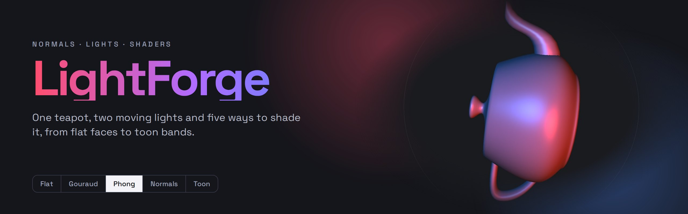
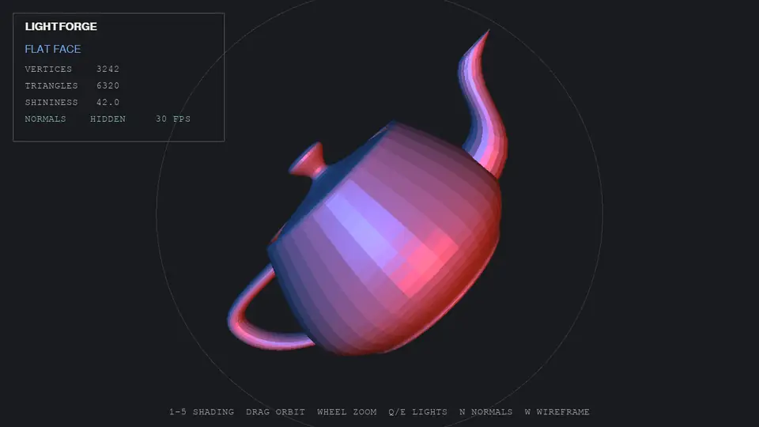
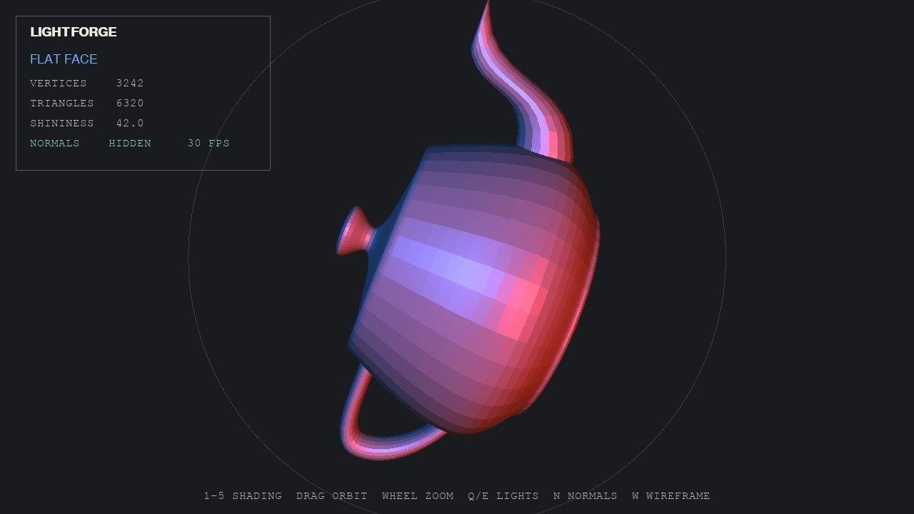
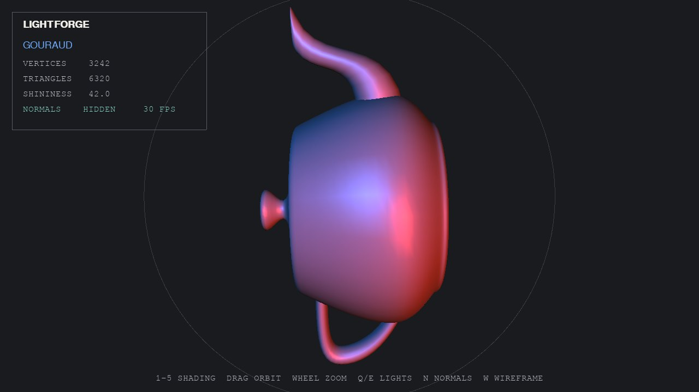
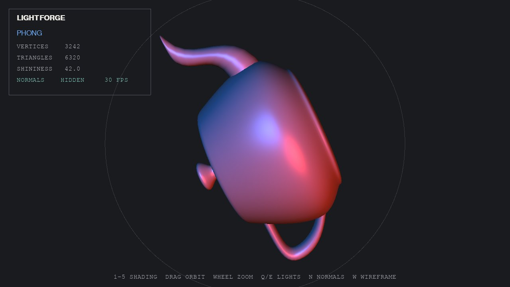
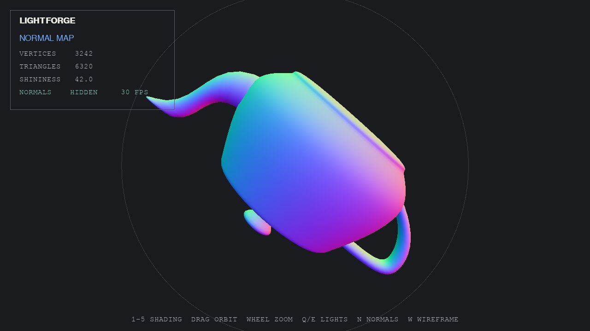
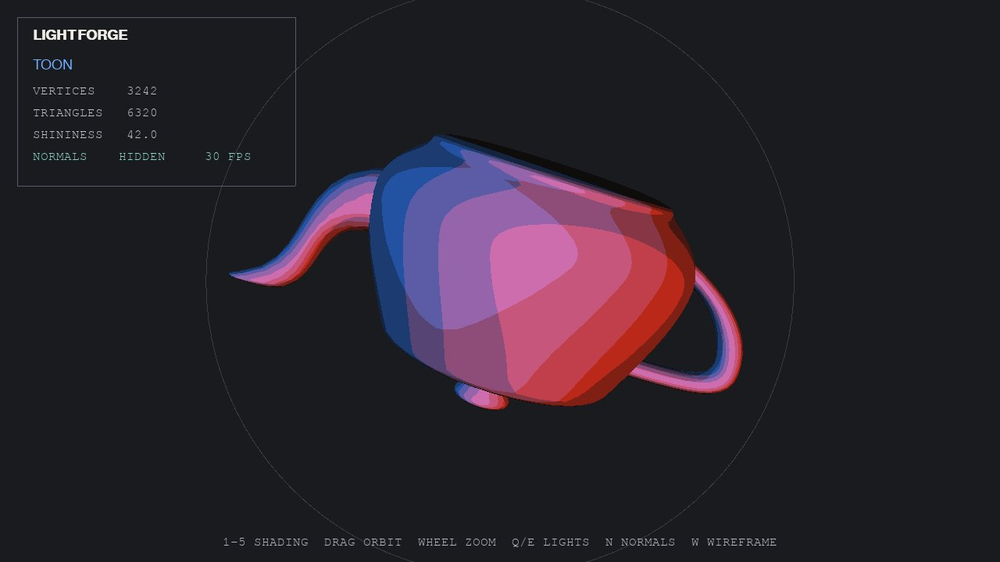

<p align="center"><code>PYTHON</code> · <code>PYGAME</code> · <code>PYOPENGL</code> · <code>GLSL</code></p>

A lighting lab built around the Utah teapot. A hand-written OBJ loader reads the mesh, computes
face and vertex normals from scratch, and hands them to GLSL shaders that render the same surface
five different ways under a red light and a blue light you can move around it.

<p align="center"></p>

## Five ways to shade one surface

<table>
  <tr>
    <td width="20%"><br><sub><b>1 · Flat</b><br>one normal per triangle</sub></td>
    <td width="20%"><br><sub><b>2 · Gouraud</b><br>lit per vertex, blended</sub></td>
    <td width="20%"><br><sub><b>3 · Phong</b><br>lit per pixel</sub></td>
    <td width="20%"><br><sub><b>4 · Normals</b><br>direction as color</sub></td>
    <td width="20%"><br><sub><b>5 · Toon</b><br>four diffuse bands</sub></td>
  </tr>
</table>

## Features

- A Wavefront OBJ parser with fan triangulation of polygon faces
- Face normals from cross products, vertex normals averaged from the faces around each vertex
- Five shading modes in GLSL, with Blinn-Phong highlights and adjustable shininess
- A red and a blue point light that move as a pair, plus wireframe and normal-vector overlays

## Run

```bash
python -m venv .venv
source .venv/bin/activate          # Windows: .venv\Scripts\activate
pip install -r requirements.txt
python main.py
```

## Controls

| Input | Action |
| :-- | :-- |
| <kbd>1</kbd>–<kbd>5</kbd> | Select a shading mode |
| Mouse drag / wheel | Orbit / zoom |
| <kbd>Q</kbd> / <kbd>E</kbd> | Move the light pair |
| <kbd>↑</kbd> / <kbd>↓</kbd> | Shininess |
| <kbd>N</kbd> / <kbd>W</kbd> | Toggle normal vectors / wireframe |
| <kbd>Space</kbd> | Pause rotation |
| <kbd>Tab</kbd> | Toggle the interface |
| <kbd>P</kbd> | Save an image |
| <kbd>F11</kbd> / <kbd>Esc</kbd> | Fullscreen / quit |

<details>
<summary><b>Launch options</b></summary>
<br>

| Variable | Effect |
| :-- | :-- |
| `LIGHTFORGE_MODE` | Starting mode, `0` (flat) to `4` (toon) |
| `PORTFOLIO_SIZE` | Window size, for example `1600x900` |
| `PORTFOLIO_FULLSCREEN=1` | Start fullscreen |
| `LIGHTFORGE_CAPTURE`, `LIGHTFORGE_CAPTURE_FRAME` | Save an image to a path at a given frame, then quit |

</details>

## How it works

- **Loading** (`mesh.py`): `v` lines become vertices and each `f` line is split into a fan of
  triangles. The mesh is centered and its bounding radius measured so the camera can frame it.
- **Normals**: a face normal is the normalized cross product of two triangle edges. A vertex
  normal is the normalized sum of the face normals that touch it, which is what makes smooth
  shading possible. Both versions are baked into OpenGL display lists, one faceted and one smooth.
- **Shading** (`shaders/mesh.vert`, `shaders/mesh.frag`): one program serves every mode through a
  `renderMode` uniform. Flat and Phong light each pixel with face or vertex normals, Gouraud lights
  each vertex and interpolates, the normal view maps direction to RGB, and toon quantizes diffuse
  light into four steps with no specular.

## Tests

```bash
pip install pytest
python -m pytest tests
```

The tests load the teapot (3,242 vertices, 6,320 triangles), check that polygons are split into
fans, that face normals follow the winding order, and that vertex normals average the faces
around them.

## Files

```text
main.py            app, camera, lights, overlays and HUD
mesh.py            OBJ loading, face and vertex normals
shaders/mesh.*     vertex and fragment shaders
assets/teapot.obj  reference mesh (see the note below)
tests/             pytest checks for OBJ loading
media/             README banner, tour and stills
```

> [!NOTE]
> `assets/teapot.obj` came from a university course distribution and is **not** covered by this
> repository's MIT License. See [THIRD_PARTY_NOTICES.md](../../THIRD_PARTY_NOTICES.md).

<sub>[← All projects](../../README.md) · Media regenerated with [`tools/render_tour.py`](../../tools/render_tour.py)</sub>
