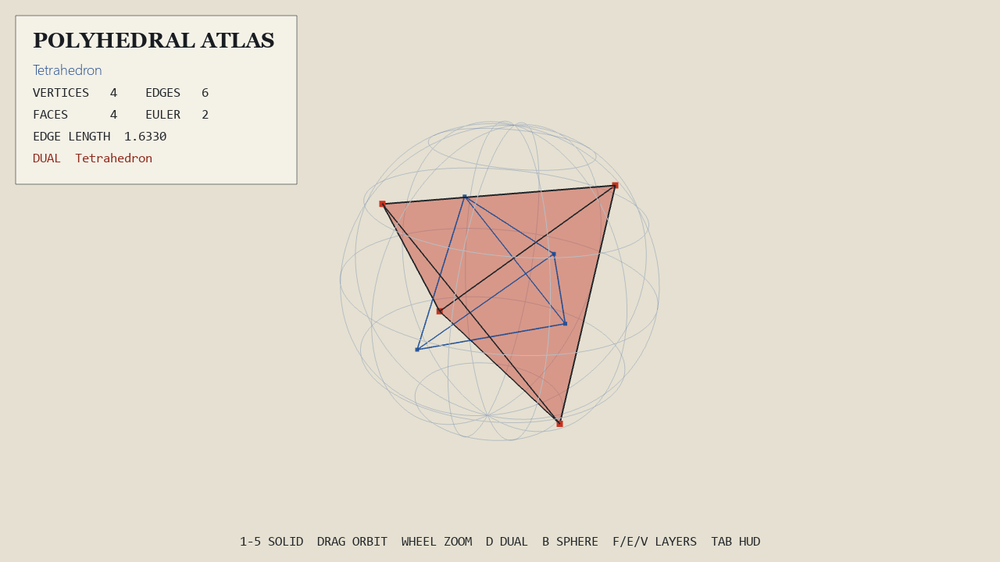

# Polyhedral Atlas

An interactive 3D explorer for the five Platonic solids. The application
combines direct manipulation with live topology measurements, dual-solid
construction, and an optional radius-one bounding sphere.



## Features

- Tetrahedron, cube, octahedron, dodecahedron, and icosahedron views
- Filled faces, edge networks, vertices, and inscribed-sphere overlays
- Computed dual geometry and live Euler-characteristic measurements
- Resizable rendering, fullscreen mode, orbit camera, and image capture

## Run

```powershell
python -m venv .venv
.\.venv\Scripts\Activate.ps1
python -m pip install -r requirements.txt
python main.py
```

## Controls

| Input | Action |
| --- | --- |
| `1`–`5` | Select a solid |
| Mouse drag / wheel | Orbit / zoom |
| `D` | Toggle the dual solid |
| `B` | Toggle the bounding sphere |
| `F`, `E`, `V` | Toggle faces, edges, or vertices |
| `Space` | Pause rotation |
| `Tab` | Toggle the interface |
| `P` | Save an image |
| `F11` | Toggle fullscreen |
| `Esc` | Quit |
