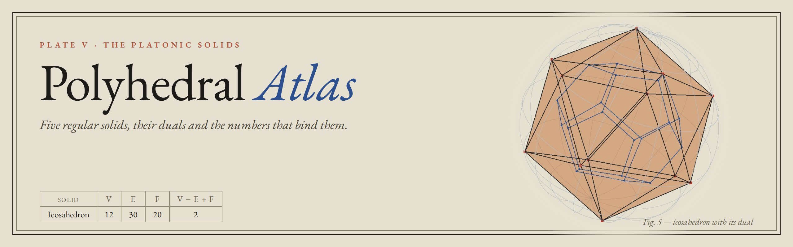
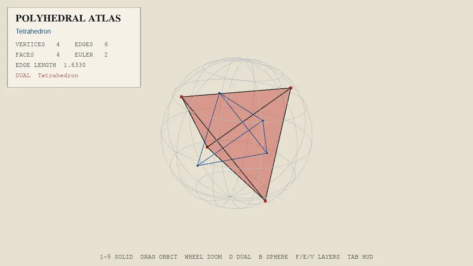
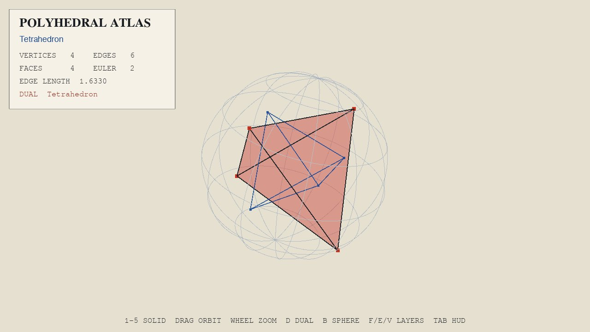
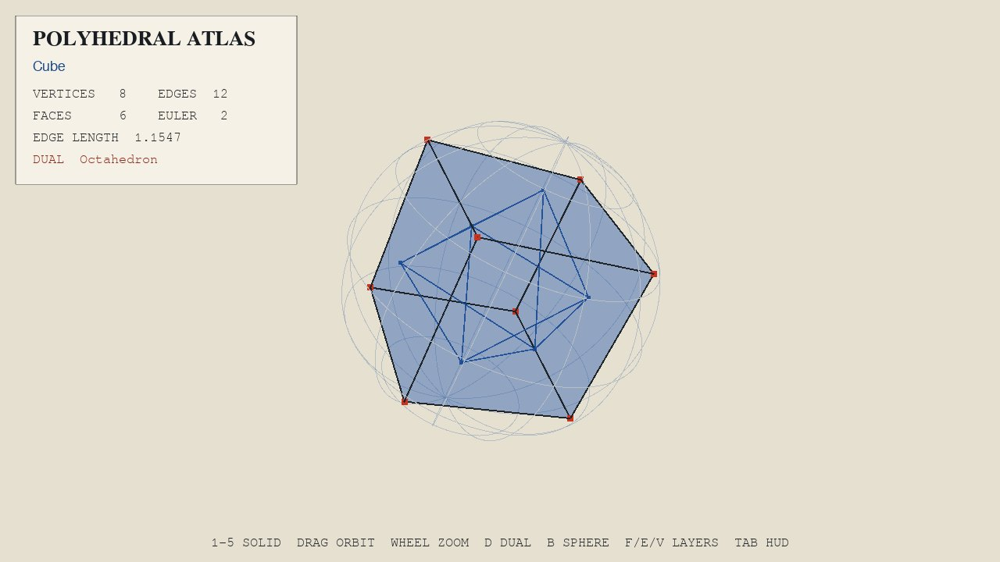
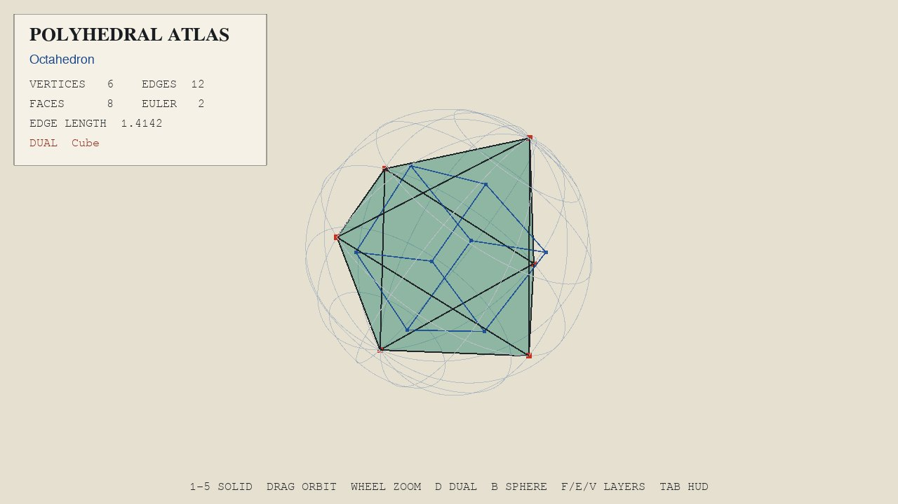
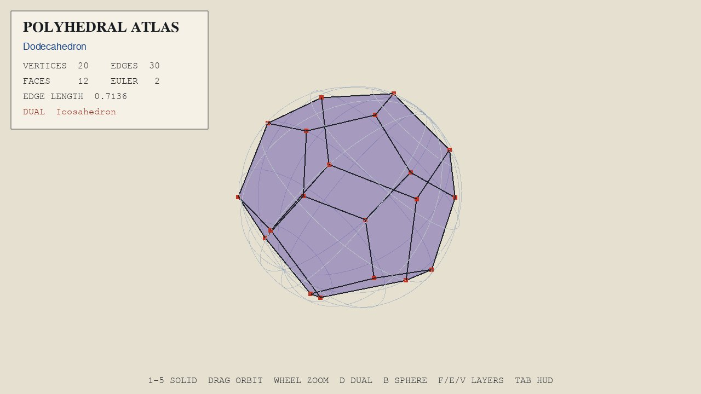
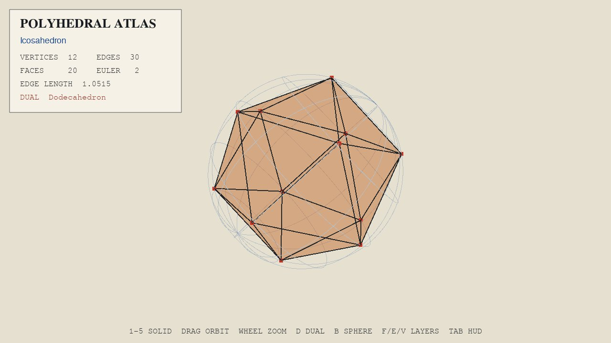

<p align="center"><code>PYTHON</code> · <code>PYGAME</code> · <code>PYOPENGL</code></p>

An interactive plate of the five Platonic solids. Turn each one in your hand, peel it back to its
edges or vertices, overlay the dual solid built from its face centers, and read off the numbers
that every convex polyhedron obeys: *V − E + F = 2*.

<p align="center"></p>

<table>
  <tr>
    <td width="20%"><br><sub><b>1 · Tetrahedron</b></sub></td>
    <td width="20%"><br><sub><b>2 · Cube</b></sub></td>
    <td width="20%"><br><sub><b>3 · Octahedron</b></sub></td>
    <td width="20%"><br><sub><b>4 · Dodecahedron</b></sub></td>
    <td width="20%"><br><sub><b>5 · Icosahedron</b></sub></td>
  </tr>
</table>

## The plate

Every solid is scaled so its vertices sit on a sphere of radius one.

| Solid | V | E | F | V − E + F | Edge length | Dual |
| :-- | --: | --: | --: | :-: | --: | :-- |
| Tetrahedron | 4 | 6 | 4 | 2 | 1.6330 | Tetrahedron |
| Cube | 8 | 12 | 6 | 2 | 1.1547 | Octahedron |
| Octahedron | 6 | 12 | 8 | 2 | 1.4142 | Cube |
| Dodecahedron | 20 | 30 | 12 | 2 | 0.7136 | Icosahedron |
| Icosahedron | 12 | 30 | 20 | 2 | 1.0515 | Dodecahedron |

## Features

- All five Platonic solids with filled faces, edge networks and vertex markers
- Dual solids computed live from face centers
- Live vertex, edge and face counts, the Euler characteristic and edge length
- The radius-one circumscribed sphere, an orbit camera, resizable windows and image capture

## Run

```bash
python -m venv .venv
source .venv/bin/activate          # Windows: .venv\Scripts\activate
pip install -r requirements.txt
python main.py
```

## Controls

| Input | Action |
| :-- | :-- |
| <kbd>1</kbd>–<kbd>5</kbd> | Select a solid |
| Mouse drag / wheel | Orbit / zoom |
| <kbd>D</kbd> | Toggle the dual solid |
| <kbd>B</kbd> | Toggle the circumscribed sphere |
| <kbd>F</kbd> / <kbd>E</kbd> / <kbd>V</kbd> | Toggle faces / edges / vertices |
| <kbd>Space</kbd> | Pause rotation |
| <kbd>0</kbd> | Reset the camera |
| <kbd>Tab</kbd> | Toggle the interface |
| <kbd>P</kbd> | Save an image |
| <kbd>F11</kbd> / <kbd>Esc</kbd> | Fullscreen / quit |

<details>
<summary><b>Launch options</b></summary>
<br>

| Variable | Effect |
| :-- | :-- |
| `PORTFOLIO_SIZE` | Window size, for example `1600x900` |
| `PORTFOLIO_FULLSCREEN=1` | Start fullscreen |
| `ATLAS_CAPTURE`, `ATLAS_CAPTURE_FRAME` | Save an image to a path at a given frame, then quit |

</details>

## How it works

- **Solids** (`geometry.py`): each solid is a list of vertices and faces. Faces are re-ordered so
  their normals point outward, and edges are collected as the unique vertex pairs that faces share.
- **Duals**: the center of every face becomes a vertex of the dual, pushed out to the unit sphere.
  Two dual vertices are joined when their faces share an edge.
- **Numbers**: V, E and F are counted from the mesh itself, so the Euler characteristic on the
  panel is computed, not typed in.

## Files

```text
main.py        rendering, panel, camera and input
geometry.py    solids, normals, edges and duals
media/         README banner, tour and stills
```

<sub>[← All projects](../../README.md) · Media regenerated with [`tools/render_tour.py`](../../tools/render_tour.py)</sub>
