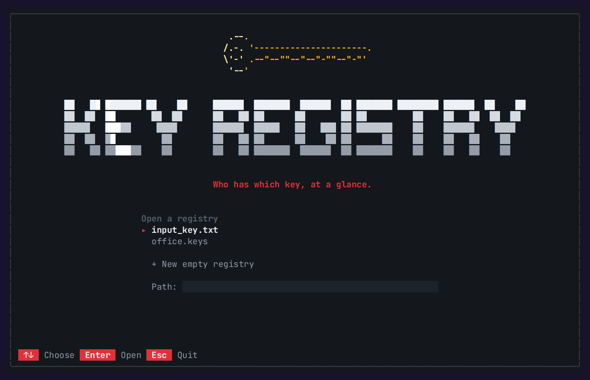
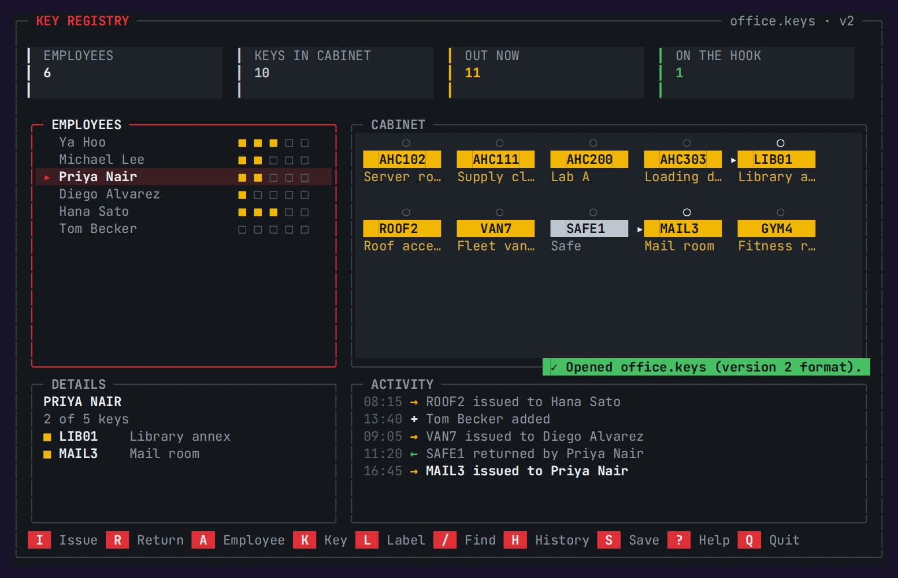
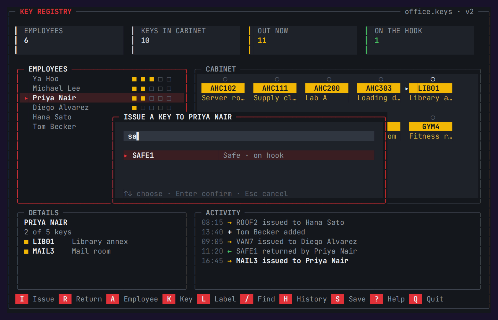
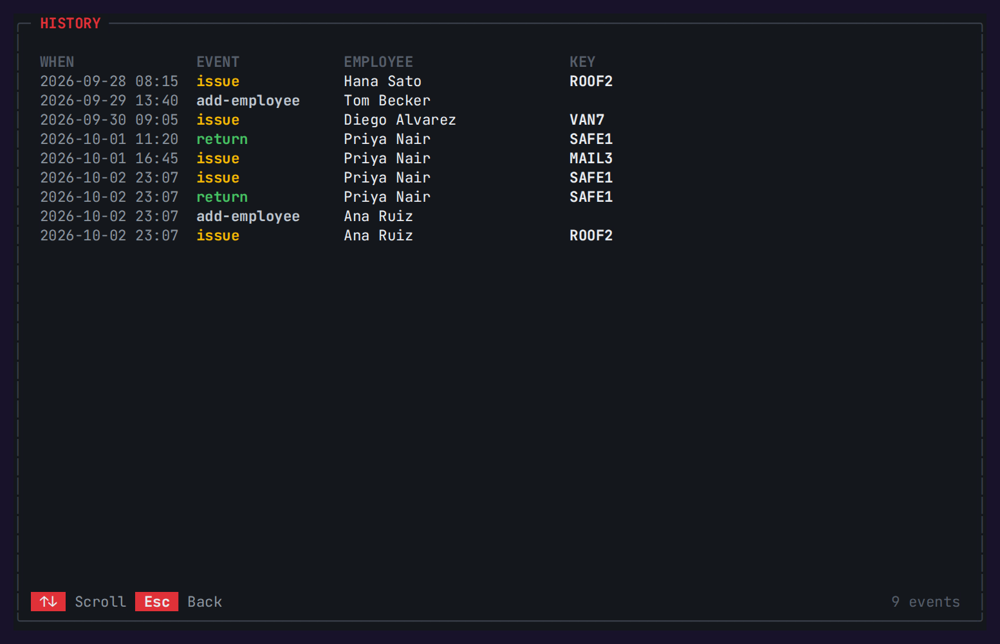

<p align="center"><code>C++17</code> · <code>TERMINAL UI</code> · <code>FILE I/O</code> · <code>NO DEPENDENCIES</code> · <code>CMAKE</code> · <code>CTEST</code></p>

A key cabinet for the terminal. It tracks which physical keys are out and who holds them, shows
the whole board at a glance, and lets you issue, return, label and audit keys from one screen.
Every change is validated and written to a timestamped history, and registries load and save in
the original course format or a richer version 2 file.

<p align="center"></p>

## Features

- **The cabinet.** Every key is a tag on the board: amber when it's out, steel when it's on the hook.
  Keys held by the selected employee are marked.
- **Employees.** Five key slots per person, shown as squares, with add and remove.
- **Issue and return in context.** Select a person to pick from the keys they don't hold, or select
  a key to pick from the people who could take it. Both lists filter as you type, and typing a new
  identifier issues and catalogues it.
- **Labels.** Note what each key opens ("Server room", "Fleet van 7").
- **History.** Every issue, return and change is recorded with the time, shown live and in a
  full-screen log.
- **Find.** One filter searches names, key identifiers and labels.
- **Files.** A file browser on start, saves that never leave a half-written file, a choice between
  the classic and version 2 formats, CSV export, and a reminder before quitting with unsaved changes.
- **Plain mode.** The original numbered menu when input is piped or with `--plain`. `NO_COLOR`
  turns colors off.

## Screens

<table>
  <tr>
    <td width="50%"><br><sub><b>Open</b> · registries in the current folder</sub></td>
    <td width="50%"><br><sub><b>Dashboard</b> · Priya's keys are marked in the cabinet</sub></td>
  </tr>
  <tr>
    <td width="50%"><br><sub><b>Issue</b> · type to filter, Enter to issue</sub></td>
    <td width="50%"><br><sub><b>History</b> · every change, with the time</sub></td>
  </tr>
</table>

## Build and run

Needs a C++17 compiler. There are no other dependencies.

```bash
cmake -S . -B build
cmake --build build
./build/key-management examples/office.keys
```

Or in one line:

```bash
g++ -std=c++17 -O2 -Isrc src/main.cpp src/core/*.cpp src/ui/*.cpp -o key-management
```

Run it with no file to choose one from the current folder. The full-screen interface needs a window
of at least 96×26 and a terminal with UTF-8 and 24-bit color (Windows Terminal, macOS Terminal or
iTerm2, any modern Linux terminal). On Visual Studio or Xcode generators the executable is in
`build/Debug` or `build/Release`.

| Option | Effect |
| :-- | :-- |
| `key-management FILE` | Open a registry directly |
| `--plain` | The original numbered menu (automatic when input is piped) |
| `NO_COLOR=1` | Turn colors off |

Two sample registries are included: [`input_key.txt`](input_key.txt), the original course file,
and [`examples/office.keys`](examples/office.keys), a labelled office cabinet with some history.

## Controls

| Key | Action |
| :-- | :-- |
| <kbd>Tab</kbd> or <kbd>←</kbd> <kbd>→</kbd> | Move between employees and the cabinet |
| <kbd>↑</kbd> <kbd>↓</kbd> <kbd>←</kbd> <kbd>→</kbd> | Choose an employee or a key |
| <kbd>I</kbd> / <kbd>R</kbd> | Issue or return, for whatever is selected |
| <kbd>A</kbd> / <kbd>D</kbd> | Add an employee, or remove one who holds no keys |
| <kbd>K</kbd> / <kbd>L</kbd> | Add a key to the cabinet, or label the selected key |
| <kbd>/</kbd> | Filter both lists |
| <kbd>H</kbd> | Full history |
| <kbd>S</kbd> / <kbd>X</kbd> | Save, or export CSV |
| <kbd>?</kbd> | Help |
| <kbd>Q</kbd> | Quit (asks to save if anything changed) |

## Rules it enforces

| Situation | Result |
| :-- | :-- |
| Issuing a sixth key to one person | "already holds the maximum of five keys" |
| Issuing a key the person already holds | "already holds that key" |
| A key identifier with spaces, `\|`, or more than 16 characters | Rejected |
| A name that's empty, padded with spaces, has `\|`, or runs past 40 characters | Rejected |
| Returning a key the person doesn't hold | "does not hold that key" |
| Removing someone who still holds keys | Refused until the keys come back |
| Adding a key that's already in the cabinet | Refused |
| A save that fails partway | The original file is untouched |

Several people can hold copies of the same key, as `AHC200` shows in the sample.

## File formats

**Classic**, the original course format: an employee count, then a name line and a key line for
each employee. Classic files are read and written exactly, byte for byte.

```text
2
Ya Hoo
3 AHC102 AHC200 AHC111
Michael Lee
2 AHC303 AHC200
```

**Version 2** adds labels, keys that nobody holds, and the history. It's plain text with labelled
sections, so it reads well and diffs cleanly:

```text
KEY_REGISTRY_V2

[keys]
AHC102 | Server room
SAFE1 | Safe

[employees]
Ya Hoo | AHC102 AHC200 AHC111
Tom Becker |

[history]
2026-10-01 16:45 | issue | Priya Nair | MAIL3
```

Files are recognised by their first line, and saving keeps the format you opened unless you switch
it in the save dialog. Errors name the line at fault, for example `Line 5: Invalid key count for Sam.`

## Design

```text
src/
  core/                 no terminal code
    Registry.h/.cpp     employees, the key catalogue, rules, history
    RegistryFile.h/.cpp classic and version 2 formats, safe saves, CSV export
  ui/
    Terminal.h/.cpp     raw keyboard input, alternate screen, styled cell canvas (POSIX and Windows)
    App.h/.cpp          the full-screen cabinet: dashboard, dialogs, history, open screen
    PlainUi.h/.cpp      the original numbered menu
  main.cpp              options and mode selection
tests/test_registry.cpp unit tests
examples/office.keys    a sample version 2 registry
```

Every change goes through `Registry`, which validates it, applies it, records it and marks the
registry as changed. Both interfaces use the same `Registry`, so the rules can't drift between
them. The history clock is injected, which keeps the tests deterministic.

## Tests

```bash
cmake -S . -B build
cmake --build build
ctest --test-dir build --output-on-failure
```

Twelve tests cover reading the classic format, holders, issue and return, every rule above,
cataloguing new identifiers, managing employees and keys, the history limit, an exact classic round
trip, a version 2 round trip that keeps labels, unheld keys and history, rejecting thirteen kinds
of broken file, line numbers in errors, and CSV quoting.

<sub>[← All projects](../README.md) · Media recorded with [`tools/terminal`](../tools/terminal)</sub>
