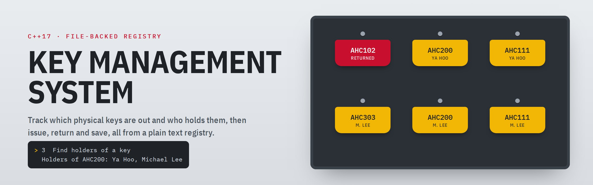

<p align="center"><code>C++17</code> · <code>STL</code> · <code>FILE I/O</code> · <code>CMAKE</code></p>

A command-line key cabinet. It loads a plain-text registry of who holds which physical keys,
answers "whose keys are these?" and "who has this key?", issues and returns keys with sensible
limits, and writes the registry back out in exactly the format it read.

## A session

Run against the included [`input_key.txt`](input_key.txt), with the menu trimmed after its first appearance:

```console
$ ./build/key-management input_key.txt

Key Registry
1. List employees and keys
2. Find an employee's keys
3. Find holders of a key
4. Issue a key
5. Return a key
6. Save registry
7. Exit
Select an option: 3
Key identifier: AHC200
Holders of AHC200: Ya Hoo, Michael Lee

Select an option: 4
Employee name: Michael Lee
Key identifier: AHC111
Key issued.

Select an option: 5
Employee name: Ya Hoo
Key identifier: AHC102
Key returned.

Select an option: 6
Output file: keys_out.txt
Registry saved to keys_out.txt.
```

## Features

- Look up an employee's keys, or every holder of a key
- Issue and return keys, with duplicate and capacity checks
- Validate the whole registry before accepting any of it
- Keep employee names that contain spaces
- Save to any path, in the same format the loader reads

## Build and run

```bash
cmake -S . -B build
cmake --build build
./build/key-management input_key.txt
```

Or compile directly with any C++17 compiler:

```bash
g++ -std=c++17 -Wall -Wextra -Wpedantic main.cpp -o key-management
```

With no argument, the program asks for the registry path. On multi-configuration generators
(Visual Studio, Xcode) the executable lands in `build/Debug` or `build/Release`.

## Registry format

The first line is the number of employees. Each employee then takes two lines: their name, then
their key count followed by the key identifiers.

```text
2
Ya Hoo
3 AHC102 AHC200 AHC111
Michael Lee
2 AHC303 AHC200
```

## Rules it enforces

| Situation | Result |
| :-- | :-- |
| Missing or invalid employee count | File rejected |
| Empty or duplicate employee name | File rejected |
| More than five keys, a missing identifier, or extra data on a key line | File rejected |
| The same key listed twice for one employee | File rejected |
| Issuing a sixth key | "already holds the maximum of five keys" |
| Issuing a key the employee already holds | "already holds that key" |
| A key identifier with spaces | "cannot contain whitespace" |
| Returning a key the employee doesn't hold | "does not hold that key" |
| A save that can't be written or doesn't finish | Reported, nothing claimed as saved |

Several employees can hold copies of the same key, as `AHC200` shows above.

## Files

```text
main.cpp         registry, validation, menu and file I/O
input_key.txt    sample registry
CMakeLists.txt   build definition (warnings on: -Wall -Wextra -Wpedantic, or /W4 on MSVC)
media/           README banner
```

<sub>[← All projects](../README.md)</sub>
