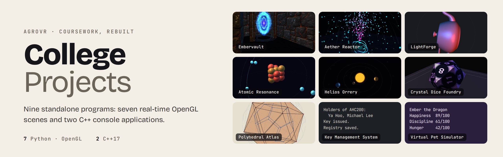

<p align="center">
  <a href="https://github.com/agrovr/CollegeProjects/actions/workflows/validate.yml"></a>
  
  
  
  <a href="LICENSE"></a>
</p>

Nine standalone programs from my coursework, rebuilt and polished: seven real-time OpenGL scenes
written in Python, and two C++ console applications. Each one has its own look, its own README
and its own way in. Pick a card.

## The collection

### Interactive graphics

<a href="Interactive%20Graphics/Embervault/README.md"></a>
**[Embervault](<Interactive Graphics/Embervault/README.md>)** · a first-person escape from a procedurally forged maze, with traps, power-ups, firelight and a rift gate to find.
<br><sub>Python · Pygame · PyOpenGL · procedural generation · audio</sub>

<a href="Interactive%20Graphics/Aether%20Reactor/README.md"></a>
**[Aether Reactor](<Interactive Graphics/Aether Reactor/README.md>)** · four particle systems on a glowing reactor core, drawn as GLSL point sprites and tuned live.
<br><sub>Python · Pygame · PyOpenGL · NumPy · GLSL</sub>

<a href="Interactive%20Graphics/LightForge/README.md"></a>
**[LightForge](<Interactive Graphics/LightForge/README.md>)** · the Utah teapot under two moving lights, loaded from OBJ and shaded five ways.
<br><sub>Python · Pygame · PyOpenGL · GLSL</sub>

<a href="Interactive%20Graphics/Atomic%20Resonance/README.md"></a>
**[Atomic Resonance](<Interactive Graphics/Atomic Resonance/README.md>)** · build an atom, excite an electron and watch it emit a photon at a real wavelength.
<br><sub>Python · Pygame · PyOpenGL</sub>

<a href="Interactive%20Graphics/Helios%20Orrery/README.md"></a>
**[Helios Orrery](<Interactive Graphics/Helios Orrery/README.md>)** · the inner planets on tilted elliptical orbits, with cameras that ride along.
<br><sub>Python · Pygame · PyOpenGL</sub>

<a href="Interactive%20Graphics/Crystal%20Dice%20Foundry/README.md"></a>
**[Crystal Dice Foundry](<Interactive Graphics/Crystal Dice Foundry/README.md>)** · polyhedral dice thrown with quaternion physics, read from the face that lands up.
<br><sub>Python · Pygame · PyOpenGL</sub>

<a href="Interactive%20Graphics/Polyhedral%20Atlas/README.md"></a>
**[Polyhedral Atlas](<Interactive Graphics/Polyhedral Atlas/README.md>)** · the five Platonic solids, their duals and the Euler characteristic, as an interactive plate.
<br><sub>Python · Pygame · PyOpenGL</sub>

### C++ applications

<a href="Key%20Management%20System/README.md"></a>
**[Key Management System](<Key Management System/README.md>)** · a full-screen key cabinet: amber tags out, steel tags on the hook, with labels, history and two file formats.
<br><sub>C++17 · terminal UI · file I/O · CMake · CTest</sub>

<a href="Virtual%20Pet%20Simulator/README.md"></a>
**[Virtual Pet Simulator](<Virtual Pet Simulator/README.md>)** · an animated terminal pet: hatch a Dragon, Unicorn or Mystic Cat and raise it through day, night and three life stages.
<br><sub>C++17 · terminal UI · polymorphism · CMake · CTest</sub>

## At a glance

| Project | What it shows | Stack |
| :-- | :-- | :-- |
| [Embervault](<Interactive Graphics/Embervault/README.md>) | Maze generation, first-person movement and collision, fog, lighting, audio | Python, PyOpenGL |
| [Aether Reactor](<Interactive Graphics/Aether Reactor/README.md>) | Particle emitters, force fields, point sprites, additive blending | Python, PyOpenGL, NumPy, GLSL |
| [LightForge](<Interactive Graphics/LightForge/README.md>) | OBJ parsing, face and vertex normals, five shading models | Python, PyOpenGL, GLSL |
| [Atomic Resonance](<Interactive Graphics/Atomic Resonance/README.md>) | Shell filling, timed state transitions, wavelength-to-color | Python, PyOpenGL |
| [Helios Orrery](<Interactive Graphics/Helios Orrery/README.md>) | Orbital elements, relative motion, eased follow cameras | Python, PyOpenGL |
| [Crystal Dice Foundry](<Interactive Graphics/Crystal Dice Foundry/README.md>) | Quaternions, collision response, texture atlases | Python, PyOpenGL |
| [Polyhedral Atlas](<Interactive Graphics/Polyhedral Atlas/README.md>) | Polyhedral topology, duals, Euler characteristic | Python, PyOpenGL |
| [Key Management System](<Key Management System/README.md>) | Terminal UI, validated state changes, versioned file formats, safe saves | C++17 |
| [Virtual Pet Simulator](<Virtual Pet Simulator/README.md>) | Terminal UI and animation, polymorphism, seeded simulation, versioned saves | C++17 |

## Getting started

```bash
git clone https://github.com/agrovr/CollegeProjects.git
cd CollegeProjects
```

**A graphics project** (Python 3.10+ and an OpenGL 2.1 capable GPU or driver):

```bash
cd "Interactive Graphics/Helios Orrery"
python -m venv .venv
source .venv/bin/activate          # Windows: .venv\Scripts\activate
pip install -r requirements.txt
python main.py
```

**A C++ project** (CMake 3.16+ and a C++17 compiler, no other dependencies):

```bash
cmake -S "Virtual Pet Simulator" -B build/pet
cmake --build build/pet
./build/pet/virtual-pet
```

Both C++ projects open a full-screen interface in a terminal of about 100×30, and fall back to
numbered menus when input is piped or with `--plain`.

Every project README lists its controls and options.

## Repository layout

```text
Interactive Graphics/<project>/   main.py, modules, shaders/, assets/, requirements.txt, media/
Key Management System/            src/core, src/ui, tests/, examples/, CMakeLists.txt, media/
Virtual Pet Simulator/            src/core, src/ui, tests/, CMakeLists.txt, media/
tools/render_tour.py              runs a graphics project headlessly with scripted input
tools/tours/                      the scripted tours behind every graphics screenshot and animation
tools/terminal/                   records the C++ apps in a pseudo-terminal and renders them
docs/brand/                       banner sources and artwork
```

## How it's checked

On every push and pull request, [Validate](.github/workflows/validate.yml):

- builds both C++ projects with warnings as errors, runs their unit tests, and drives a session
  through each one's plain menu;
- builds and tests both C++ projects again on **Windows and macOS**;
- compiles every Python source; and
- **launches all seven graphics projects headlessly**, drives them with scripted input for a few
  seconds, and checks that each one actually rendered a frame.

The screenshots and animations in these READMEs come from the same tool. To regenerate one:

```bash
pip install -r "Interactive Graphics/Aether Reactor/requirements.txt" pillow
SDL_VIDEODRIVER=offscreen python tools/render_tour.py "Interactive Graphics/Helios Orrery" tools/tours/helios-orrery.json -o tour-output
```

Banners are rendered from [`docs/brand/banners.html`](docs/brand/banners.html) (`?p=<project>`,
screenshot `#card` at 2×).

## License

Original source code, documentation and project-created assets are available under the
[MIT License](LICENSE). Dependencies keep their own licenses, and the LightForge teapot mesh is
excluded; see [Third-Party and Asset Notices](THIRD_PARTY_NOTICES.md).

<p align="center"><sub>Made by <a href="https://github.com/agrovr">agrovr</a> · <a href="https://agrover7.com">agrover7.com</a></sub></p>
