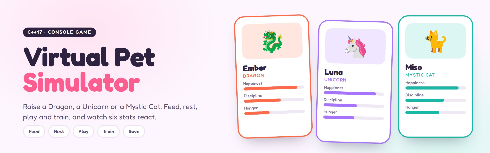
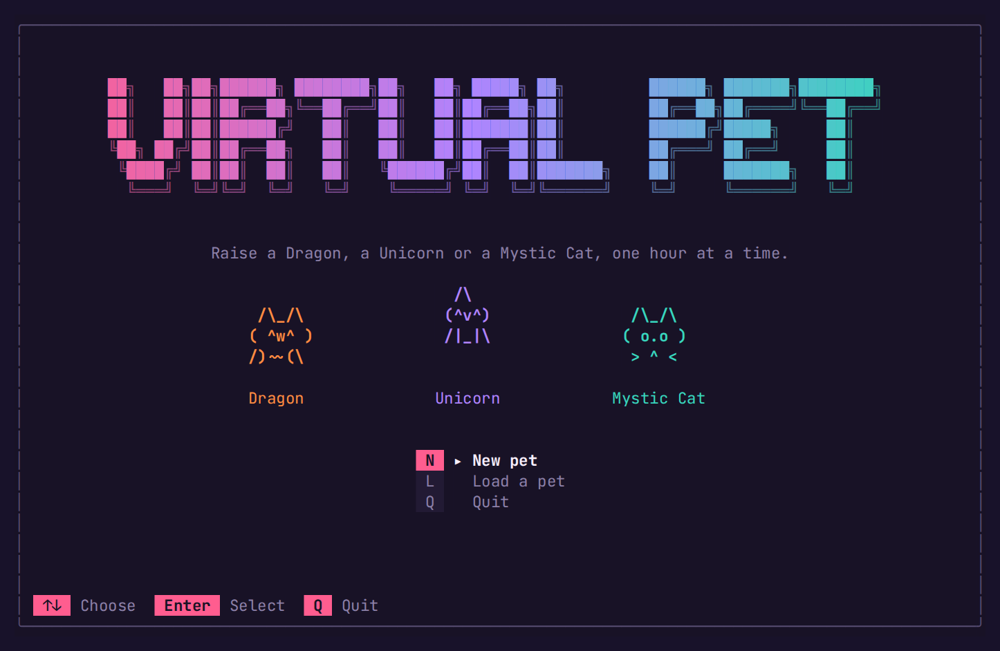
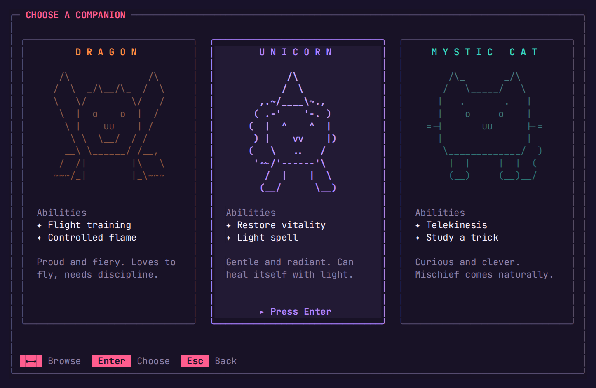
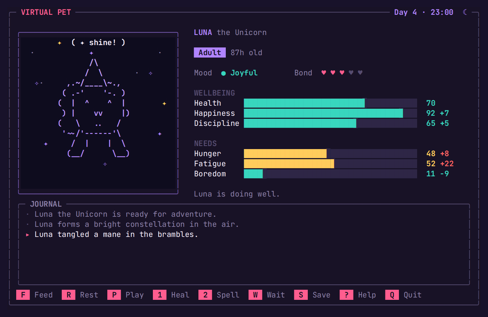
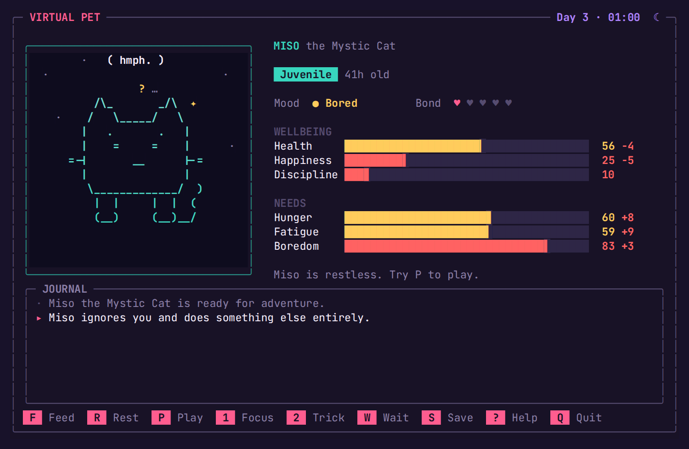
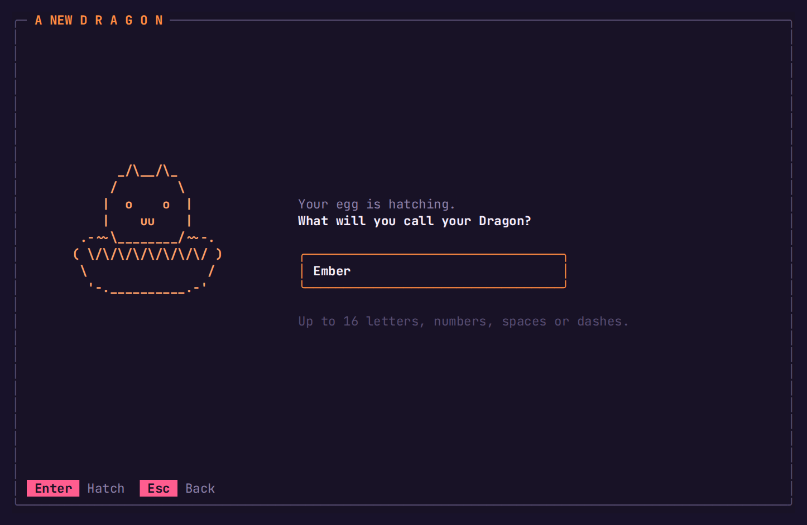
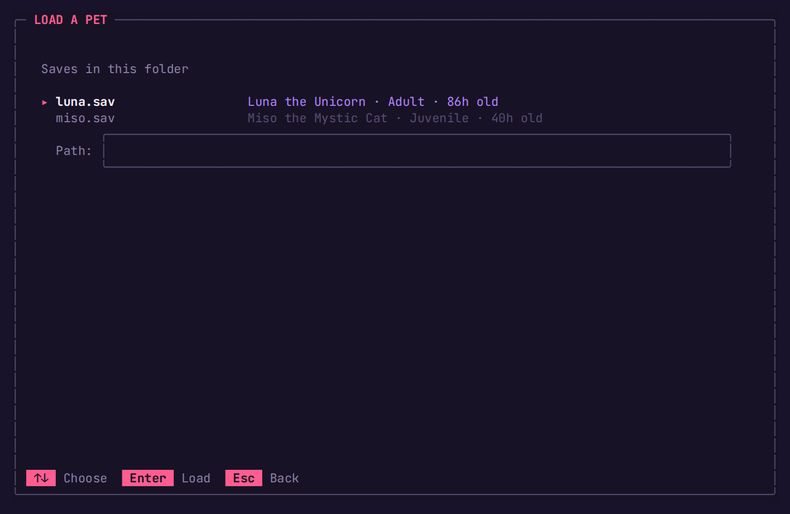
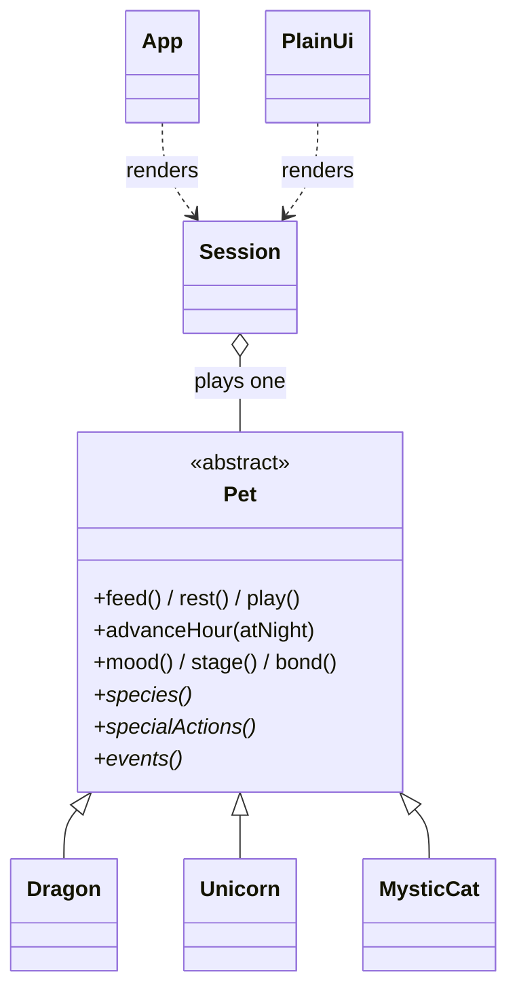

<p align="center"><code>C++17</code> · <code>TERMINAL UI</code> · <code>POLYMORPHISM</code> · <code>NO DEPENDENCIES</code> · <code>CMAKE</code> · <code>CTEST</code></p>

A pocket pet that lives in your terminal. Hatch a Dragon, a Unicorn or a Mystic Cat, name it, and
look after it one hour at a time. A full-screen, animated interface shows your pet's mood on its
face, six needs as live meters, and a journal of everything that happens, from naps in sunbeams
to cups knocked off tables on purpose.

<p align="center"></p>

## Features

**The game**

- Three species, each with two abilities and its own random events
- Six needs that drift every hour, with real consequences when they're ignored
- A day and night cycle: nights tire your pet faster, but sleep restores more
- Discipline that matters: a wild pet may ignore play and training
- A bond that grows through happy, cared-for hours
- Three life stages, Hatchling, Juvenile and Adult, with a new look as your pet grows

**The interface**

- Animated ASCII creatures whose faces follow their mood, with blinks, bobbing and reactions
- Particle effects for every action: crumbs, hearts, z's, flame, wind, sparkles and healing light
- Live meters with color thresholds, change indicators and alerts for urgent needs
- A save browser that reads the `.sav` files in the folder, plus save and quit dialogs
- Plain numbered menus when input is piped or with `--plain`, and `NO_COLOR` support

## Screens

<table>
  <tr>
    <td width="50%"><br><sub><b>Title</b></sub></td>
    <td width="50%"><br><sub><b>Choose a companion</b></sub></td>
  </tr>
  <tr>
    <td width="50%"><br><sub><b>Night</b> · an adult Unicorn casts a light spell</sub></td>
    <td width="50%"><br><sub><b>Low discipline</b> · Miso ignores you</sub></td>
  </tr>
  <tr>
    <td width="50%"><br><sub><b>Hatching</b> · name your pet</sub></td>
    <td width="50%"><br><sub><b>Load</b> · saves in the current folder</sub></td>
  </tr>
</table>

## Build and run

Needs a C++17 compiler. There are no other dependencies.

```bash
cmake -S . -B build
cmake --build build
./build/virtual-pet
```

Or in one line:

```bash
g++ -std=c++17 -O2 -Isrc src/main.cpp src/core/*.cpp src/core/species/*.cpp src/ui/*.cpp -o virtual-pet
```

The full-screen interface needs a window of at least 88×26 and a terminal with UTF-8 and
24-bit color: Windows Terminal, macOS Terminal or iTerm2, and any modern Linux terminal all work.
On multi-configuration generators (Visual Studio, Xcode) the executable lands in `build/Debug` or
`build/Release`.

| Option | Effect |
| :-- | :-- |
| `virtual-pet ember.sav` | Open a save directly |
| `--plain` | Numbered line menus instead of the full-screen interface (automatic when input is piped) |
| `--seed N` | Fix the random seed, so events repeat exactly |
| `NO_COLOR=1` | Turn colors off |

## Controls

| Key | Action |
| :-- | :-- |
| <kbd>F</kbd> | Feed |
| <kbd>R</kbd> | Rest |
| <kbd>P</kbd> | Play |
| <kbd>1</kbd> / <kbd>2</kbd> | Use the species' first or second ability |
| <kbd>W</kbd> or <kbd>Space</kbd> | Let an hour pass |
| <kbd>S</kbd> | Save |
| <kbd>?</kbd> | How it works |
| <kbd>Q</kbd> or <kbd>Esc</kbd> | Leave (asks whether to save) |

Menus use the arrow keys and <kbd>Enter</kbd>; every menu item also has a letter or number.

## The species

| | Species | Ability 1 | Ability 2 | Personality |
| :-: | :-- | :-- | :-- | :-- |
| 🐉 | **Dragon** | *Flight training*: big boredom relief, tiring | *Controlled flame*: discipline up, works up an appetite | Finds coins for its hoard, sneezes sparks |
| 🦄 | **Unicorn** | *Restore vitality*: heals 18 health | *Light spell*: happiness and discipline up | Dances under rainbows, snags its mane |
| 🐈 | **Mystic Cat** | *Telekinesis*: discipline up, tiring | *Study a trick*: the biggest boredom relief | Naps in sunbeams, knocks cups over on purpose |

## How it plays

| Rule | Detail |
| :-- | :-- |
| **Time** | Every action, ability or wait takes one hour. The clock starts at 08:00 on day 1. |
| **Needs** | Each hour, hunger rises by 8, fatigue by 6 (9 at night) and boredom by 7. |
| **Neglect** | Every need at 75 or more costs 4 health and 5 happiness that hour. |
| **Care** | Feeding takes 25 hunger, resting 30 fatigue (40 at night), playing 25 boredom. Feeding a full pet backfires. |
| **Discipline** | Below 25, a pet may ignore play and abilities, up to half the time at zero. Abilities raise it. |
| **Bond** | Grows by one for every hour with no unmet needs and happiness of 60 or more. |
| **Growth** | Hatchling until 24 hours, Juvenile until 72, then Adult. |
| **Events** | Each hour has a 14% chance of a species event that nudges the stats. |
| **Mood** | Unwell below 30 health; otherwise the most pressing need (60+) decides, then happiness. |

All stats stay between 0 and 100. Nothing is permanent: an unwell pet recovers with rest and food.

## Save files

Saves are small text files. The name is quoted so it can contain spaces, and every value is
checked on load. Version 1 saves from earlier releases still load.

```text
VIRTUAL_PET_SAVE_V2
Dragon
"Ember"
34 37 34 80 100 57
2 2
```

Line 4 is hunger, fatigue, boredom, happiness, health and discipline; line 5 is age in hours and bond.

## Design

```text
src/
  core/                 game rules, no terminal code
    Pet.h/.cpp          stats, needs, mood, growth, bond
    species/            Dragon, Unicorn, MysticCat
    Session.h/.cpp      clock, day and night, refusals, random events, journal
    SaveFile.h/.cpp     versioned save format
  ui/
    Terminal.h/.cpp     raw keyboard input, alternate screen, styled cell canvas (POSIX and Windows)
    Art.h/.cpp          creature templates with mood-driven faces
    App.h/.cpp          the full-screen interface and its animations
    PlainUi.h/.cpp      numbered menus for pipes and simple consoles
  main.cpp              options and mode selection
tests/test_core.cpp     unit tests for the rules, saves and art
```



`Session` owns the pet through a `std::unique_ptr<Pet>` and only uses the base class. A species
is data plus a subclass: its name, two abilities and its events. Both interfaces drive the same
`Session`, so the rules are identical whichever one you use, and a fixed `--seed` makes a whole
game reproducible.

## Tests

```bash
cmake -S . -B build
cmake --build build
ctest --test-dir build --output-on-failure
```

Seventeen tests cover stat limits, feeding and overfeeding, night rest, neglect, bond, mood,
growth, abilities, the clock, seeded determinism, refusal odds, the journal, save round trips,
loading version 1 saves, rejecting broken saves, and the shape of every piece of creature art.

<sub>[← All projects](../README.md) · Media recorded with [`tools/terminal`](../tools/terminal)</sub>
