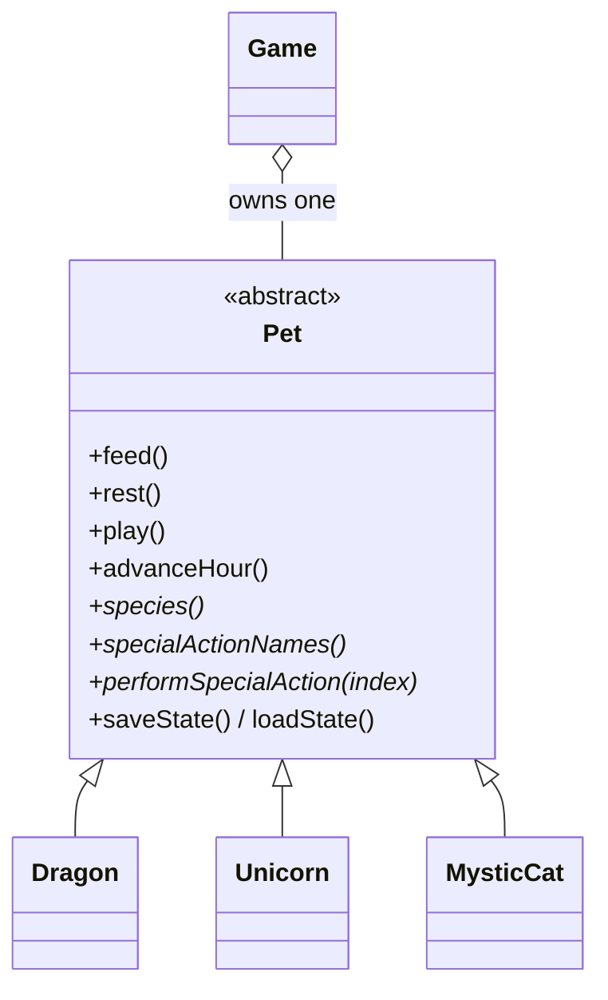

<p align="center"><code>C++17</code> · <code>INHERITANCE</code> · <code>POLYMORPHISM</code> · <code>FILE I/O</code> · <code>CMAKE</code></p>

A console pet you raise one hour at a time. Choose a Dragon, a Unicorn or a Mystic Cat, give it a
name, and look after six needs that drift as time passes. Every species shares the basics and adds
two abilities of its own, and your pet can be saved and loaded between sessions.

## A session

```console
$ ./build/virtual-pet
Virtual Pet Simulator

1. Create a pet
2. Load a pet
3. Exit
Select an option: 1
Choose a species: 1
Pet name: Ember
Ember is ready for adventure.

Select an action: 6
Ember shapes a precise ribbon of flame.
Select an action: 5
Ember completes a sweeping flight circuit.
Select an action: 2
Your pet enjoyed a balanced meal.
Select an action: 1

Ember the Dragon
Health:    100/100
Happiness: 89/100
Hunger:    42/100
Fatigue:   57/100
Boredom:   23/100
Discipline: 61/100

Select an action: 8
Save file: ember.sav
Pet saved to ember.sav.
```

<sub>Menus are trimmed after their first appearance.</sub>

## The species

| | Species | Ability 1 | Ability 2 |
| :-: | :-- | :-- | :-- |
| 🐉 | **Dragon** | *Complete flight training*: big boredom relief, tiring | *Breathe a controlled flame*: discipline up, works up an appetite |
| 🦄 | **Unicorn** | *Restore vitality*: heals 18 health | *Shape a light spell*: happiness and discipline up |
| 🐈 | **Mystic Cat** | *Focus telekinesis*: discipline up, tiring | *Study a new trick*: the biggest boredom relief, a little hungry |

Shared actions: **Feed** (hunger −25), **Rest** (fatigue −30), **Play** (boredom −25, happiness +10),
**View status**, **Advance one hour**, **Save** and **Return to main menu**.

## How time works

Every care action, ability or *Advance one hour* moves the clock forward one hour. Each hour,
hunger rises by 8, fatigue by 6 and boredom by 7. If any of those reach 75, health and happiness
fall for every unmet need; if none do, happiness ticks up by one. All six stats stay between 0
and 100.

## Build and run

```bash
cmake -S . -B build
cmake --build build
./build/virtual-pet
```

Or compile directly with any C++17 compiler:

```bash
g++ -std=c++17 -Wall -Wextra -Wpedantic main.cpp Game.cpp Pet.cpp Dragon.cpp Unicorn.cpp MysticCat.cpp -o virtual-pet
```

On multi-configuration generators (Visual Studio, Xcode) the executable lands in `build/Debug`
or `build/Release`.

## Save files

Saves are small, versioned text files. The name is quoted so it can contain spaces, and every
value is validated on load.

```text
VIRTUAL_PET_SAVE_V1
Dragon
"Ember"
42 57 23 89 100 61
```

The numbers are hunger, fatigue, boredom, happiness, health and discipline.

## Design



`Game` owns the current pet through a `std::unique_ptr<Pet>` and only talks to the base class, so
adding a species means one new subclass, plus a branch in `Game::makePet` and an entry in the species menu. Menu input recovers
cleanly from anything that isn't a valid choice.

## Files

```text
main.cpp                         entry point
Game.h / Game.cpp                menus, creation, loading and saving
Pet.h / Pet.cpp                  shared needs, time and persistence
Dragon.* / Unicorn.* / MysticCat.*   species abilities
CMakeLists.txt                   build definition
media/                           README banner
```

<sub>[← All projects](../README.md)</sub>
